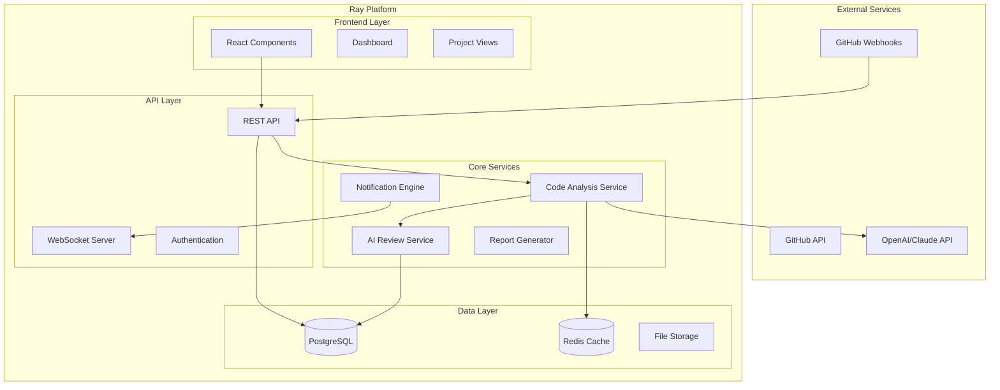

# Design Document

## Overview

The AI-Powered Code Review & Technical Debt Management system will extend the existing Ray platform with intelligent code analysis capabilities. The system integrates with GitHub repositories, leverages AI models for code analysis, and seamlessly connects code quality insights with the existing project management workflow. The architecture follows a microservices approach with real-time analysis, webhook-driven updates, and comprehensive reporting capabilities.

## Architecture

### High-Level Architecture



### Service Architecture

The system will be built as a set of interconnected services that integrate with the existing Ray platform:

1. **Code Analysis Service**: Handles repository connections, code parsing, and analysis orchestration
2. **AI Review Service**: Manages AI-powered code review and suggestion generation
3. **Technical Debt Tracker**: Monitors and quantifies technical debt over time
4. **Integration Service**: Manages GitHub webhooks and API interactions
5. **Notification Engine**: Handles real-time updates and alerts

## Components and Interfaces

### 1. Repository Connection Manager

**Purpose**: Manages GitHub repository connections and authentication

**Key Components**:
- OAuth integration with GitHub
- Repository selection and configuration
- Webhook management
- Access token refresh handling

**Interfaces**:
```typescript
interface RepositoryConnection {
  id: string;
  projectId: string;
  repositoryUrl: string;
  accessToken: string;
  webhookId: string;
  isActive: boolean;
  lastAnalyzed: Date;
  analysisStatus: 'pending' | 'analyzing' | 'completed' | 'failed';
}

interface GitHubRepository {
  id: number;
  name: string;
  fullName: string;
  private: boolean;
  defaultBranch: string;
  language: string;
  size: number;
}
```

### 2. Code Analysis Engine

**Purpose**: Performs static code analysis and generates quality metrics

**Key Components**:
- AST parsing for multiple languages (TypeScript, JavaScript, Python, Java, Go)
- Complexity calculation (Cyclomatic, Cognitive)
- Code smell detection
- Security vulnerability scanning
- Test coverage analysis

**Interfaces**:
```typescript
interface CodeAnalysisResult {
  repositoryId: string;
  commitSha: string;
  analyzedAt: Date;
  metrics: CodeMetrics;
  issues: CodeIssue[];
  securityFindings: SecurityFinding[];
  testCoverage: TestCoverageReport;
}

interface CodeMetrics {
  linesOfCode: number;
  cyclomaticComplexity: number;
  cognitiveComplexity: number;
  technicalDebtRatio: number;
  maintainabilityIndex: number;
  duplicatedLines: number;
}

interface CodeIssue {
  id: string;
  type: 'bug' | 'vulnerability' | 'code_smell' | 'security_hotspot';
  severity: 'critical' | 'major' | 'minor' | 'info';
  file: string;
  line: number;
  column: number;
  message: string;
  rule: string;
  effort: number; // minutes to fix
  aiSuggestion?: string;
}
```

### 3. AI Review Service

**Purpose**: Provides AI-powered code review suggestions and improvements

**Key Components**:
- Integration with OpenAI/Claude APIs
- Context-aware code analysis
- Personalized suggestion generation
- Learning pattern recognition

**Interfaces**:
```typescript
interface AIReviewRequest {
  code: string;
  language: string;
  context: CodeContext;
  developerProfile: DeveloperProfile;
  reviewType: 'pull_request' | 'commit' | 'on_demand';
}

interface AIReviewResponse {
  overallScore: number;
  suggestions: ReviewSuggestion[];
  positiveAspects: string[];
  riskAssessment: RiskAssessment;
  estimatedReviewTime: number;
}

interface ReviewSuggestion {
  type: 'improvement' | 'bug_fix' | 'security' | 'performance' | 'style';
  priority: 'high' | 'medium' | 'low';
  description: string;
  codeExample?: string;
  learningResource?: string;
  line?: number;
  column?: number;
}
```

### 4. Technical Debt Tracker

**Purpose**: Quantifies and tracks technical debt over time

**Key Components**:
- Debt calculation algorithms
- Trend analysis
- Impact assessment on project timelines
- Remediation prioritization

**Interfaces**:
```typescript
interface TechnicalDebtReport {
  projectId: string;
  totalDebtMinutes: number;
  debtRatio: number;
  trend: 'improving' | 'stable' | 'degrading';
  categories: DebtCategory[];
  impactOnVelocity: number; // percentage
  recommendedActions: RemediationAction[];
}

interface DebtCategory {
  type: 'complexity' | 'duplication' | 'coverage' | 'security' | 'maintainability';
  debtMinutes: number;
  issueCount: number;
  trend: number; // percentage change
}

interface RemediationAction {
  priority: number;
  description: string;
  estimatedEffort: number;
  expectedImpact: number;
  affectedFiles: string[];
}
```

### 5. Integration Layer

**Purpose**: Handles external service integrations and webhook processing

**Key Components**:
- GitHub webhook handlers
- API rate limiting
- Error handling and retry logic
- Event processing queue

**Interfaces**:
```typescript
interface WebhookEvent {
  type: 'push' | 'pull_request' | 'release';
  repository: string;
  payload: any;
  timestamp: Date;
}

interface AnalysisJob {
  id: string;
  repositoryId: string;
  type: 'full_analysis' | 'incremental' | 'pull_request';
  status: 'queued' | 'processing' | 'completed' | 'failed';
  priority: number;
  createdAt: Date;
  completedAt?: Date;
}
```

## Data Models

### Database Schema Extensions

The system will extend the existing Prisma schema with new models:

```prisma
model CodeRepository {
  id             String   @id @default(uuid())
  projectId      String
  project        Project  @relation(fields: [projectId], references: [id], onDelete: Cascade)
  repositoryUrl  String
  repositoryName String
  accessToken    String   // Encrypted
  webhookId      String?
  isActive       Boolean  @default(true)
  lastAnalyzed   DateTime?
  createdAt      DateTime @default(now())
  updatedAt      DateTime @updatedAt
  
  analyses       CodeAnalysis[]
  issues         CodeQualityIssue[]
  
  @@index([projectId])
  @@map("code_repository")
}

model CodeAnalysis {
  id                    String         @id @default(uuid())
  repositoryId          String
  repository            CodeRepository @relation(fields: [repositoryId], references: [id], onDelete: Cascade)
  commitSha             String
  branch                String
  linesOfCode           Int
  cyclomaticComplexity  Float
  technicalDebtMinutes  Int
  maintainabilityIndex  Float
  testCoverage          Float?
  securityScore         Float
  analyzedAt            DateTime       @default(now())
  
  issues                CodeQualityIssue[]
  
  @@index([repositoryId, analyzedAt])
  @@map("code_analysis")
}

model CodeQualityIssue {
  id           String        @id @default(uuid())
  repositoryId String
  repository   CodeRepository @relation(fields: [repositoryId], references: [id], onDelete: Cascade)
  analysisId   String?
  analysis     CodeAnalysis? @relation(fields: [analysisId], references: [id], onDelete: SetNull)
  issueId      String?       // Link to existing Issue model
  issue        Issue?        @relation(fields: [issueId], references: [id], onDelete: SetNull)
  
  type         CodeIssueType
  severity     CodeIssueSeverity
  file         String
  line         Int
  column       Int?
  message      String
  rule         String
  effort       Int           // minutes to fix
  aiSuggestion String?
  status       CodeIssueStatus @default(OPEN)
  
  createdAt    DateTime      @default(now())
  resolvedAt   DateTime?
  
  @@index([repositoryId, status])
  @@index([type, severity])
  @@map("code_quality_issue")
}

model AICodeReview {
  id               String   @id @default(uuid())
  repositoryId     String
  pullRequestId    String?
  commitSha        String
  overallScore     Float
  reviewType       String
  suggestions      Json     // Array of ReviewSuggestion
  positiveAspects  String[]
  riskLevel        String
  reviewedAt       DateTime @default(now())
  
  @@index([repositoryId, reviewedAt])
  @@map("ai_code_review")
}

model DeveloperProfile {
  id                String   @id @default(uuid())
  userId            String   @unique
  user              User     @relation(fields: [userId], references: [id], onDelete: Cascade)
  skillLevel        String   // 'junior', 'mid', 'senior'
  preferredLanguages String[]
  codingPatterns    Json     // Analyzed patterns
  improvementAreas  String[]
  lastUpdated       DateTime @updatedAt
  
  @@map("developer_profile")
}

enum CodeIssueType {
  BUG
  VULNERABILITY
  CODE_SMELL
  SECURITY_HOTSPOT
  PERFORMANCE
  MAINTAINABILITY
}

enum CodeIssueSeverity {
  CRITICAL
  MAJOR
  MINOR
  INFO
}

enum CodeIssueStatus {
  OPEN
  IN_PROGRESS
  RESOLVED
  WONT_FIX
  FALSE_POSITIVE
}
```

## Error Handling

### Error Categories and Responses

1. **GitHub API Errors**:
   - Rate limiting: Implement exponential backoff
   - Authentication failures: Refresh tokens automatically
   - Repository access denied: Notify users and provide re-authorization flow

2. **AI Service Errors**:
   - API timeouts: Retry with fallback to simpler analysis
   - Token limits: Chunk large code files
   - Service unavailable: Queue requests for later processing

3. **Analysis Errors**:
   - Unsupported file types: Skip with warning
   - Parse errors: Log for debugging, continue with other files
   - Memory/timeout issues: Implement analysis chunking

### Error Recovery Strategies

```typescript
interface ErrorHandler {
  handleGitHubError(error: GitHubError): Promise<void>;
  handleAIServiceError(error: AIServiceError): Promise<void>;
  handleAnalysisError(error: AnalysisError): Promise<void>;
  retryWithBackoff(operation: () => Promise<any>, maxRetries: number): Promise<any>;
}
```

## Testing Strategy

### Unit Testing
- **Code Analysis Engine**: Test parsing accuracy, metric calculations
- **AI Review Service**: Mock AI responses, test suggestion formatting
- **Integration Layer**: Test webhook processing, API interactions
- **Data Models**: Test CRUD operations, relationships

### Integration Testing
- **GitHub Integration**: Test OAuth flow, webhook handling
- **AI Service Integration**: Test request/response handling
- **Database Operations**: Test complex queries, performance

### End-to-End Testing
- **Repository Connection Flow**: Complete user journey from connection to analysis
- **Issue Creation Workflow**: Verify code issues become project issues
- **Real-time Updates**: Test WebSocket notifications
- **Performance Testing**: Large repository analysis, concurrent users

### Testing Tools and Frameworks
- **Jest**: Unit and integration testing
- **Playwright**: E2E testing
- **MSW**: API mocking
- **Test Containers**: Database testing

## Performance Considerations

### Scalability Design
- **Async Processing**: Use job queues for analysis tasks
- **Caching Strategy**: Redis for frequently accessed data
- **Database Optimization**: Proper indexing, query optimization
- **Rate Limiting**: Respect GitHub API limits

### Performance Targets
- **Analysis Time**: < 5 minutes for repositories up to 100k LOC
- **Real-time Updates**: < 2 seconds for webhook processing
- **Dashboard Load**: < 1 second for code health metrics
- **Concurrent Users**: Support 100+ simultaneous analyses

### Monitoring and Alerting
- **Analysis Queue Depth**: Alert if queue grows beyond threshold
- **API Response Times**: Monitor GitHub and AI service latency
- **Error Rates**: Track and alert on analysis failures
- **Resource Usage**: Monitor CPU, memory, and database performance