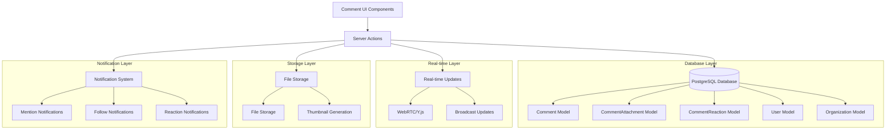

# Design Document

## Overview

The commenting system will provide a comprehensive, scalable solution for contextual discussions on projects, issues, features, and milestones. This enhanced design includes file attachments, emoji reactions, and a clean mention system using JSON content storage for maximum flexibility and performance.

Following the established architectural patterns in the codebase, it will integrate seamlessly with the existing Document system, user management, and real-time collaboration infrastructure while providing a modern, Linear-like commenting experience.

## Architecture

### High-Level Architecture



### Data Flow

1. **Comment Creation**: User creates comment → Parse mentions → Upload attachments → Save to database → Broadcast real-time update → Send notifications
2. **Comment Display**: Load comments → Resolve user mentions → Load attachments → Display with reactions → Subscribe to real-time updates
3. **File Upload**: Select files → Upload to storage → Generate thumbnails → Associate with comment
4. **Reactions**: Click emoji → Toggle reaction → Update counts → Broadcast to other users
5. **User Mentions**: Type "@" → Search organization members → Select user → Insert mention → Extract user IDs on save

## Components and Interfaces

### Database Models

#### Enhanced Comment Models

```prisma
model Comment {
    id             String       @id @default(uuid())
    content        String       // Content with user:{userId} mentions
    organizationId String
    organization   Organization @relation(fields: [organizationId], references: [id], onDelete: Cascade)
    authorId       String
    author         User         @relation("AuthoredComments", fields: [authorId], references: [id], onDelete: SetNull)

    // Entity relationships (similar to Document model)
    projectId   String?
    project     Project?   @relation(fields: [projectId], references: [id], onDelete: Cascade)
    issueId     String?
    issue       Issue?     @relation(fields: [issueId], references: [id], onDelete: Cascade)
    featureId   String?
    feature     Feature?   @relation(fields: [featureId], references: [id], onDelete: Cascade)
    milestoneId String?
    milestone   Milestone? @relation(fields: [milestoneId], references: [id], onDelete: Cascade)

    // Comment metadata
    mentionedUserIds String[]    // Array of user IDs for efficient querying
    isEdited         Boolean     @default(false)
    isDeleted        Boolean     @default(false)
    createdAt        DateTime    @default(now())
    updatedAt        DateTime    @updatedAt
    editedAt         DateTime?

    // Relations
    attachments CommentAttachment[]
    reactions   CommentReaction[]

    @@index([organizationId])
    @@index([authorId])
    @@index([projectId])
    @@index([issueId])
    @@index([featureId])
    @@index([milestoneId])
    @@index([organizationId, projectId])
    @@index([organizationId, issueId])
    @@index([organizationId, featureId])
    @@index([organizationId, milestoneId])
    @@index([createdAt])
    @@index([mentionedUserIds])
    @@map("comment")
}

model CommentAttachment {
    id             String       @id @default(uuid())
    commentId      String
    comment        Comment      @relation(fields: [commentId], references: [id], onDelete: Cascade)
    fileName       String
    originalName   String
    mimeType       String
    fileSize       Int
    url            String
    thumbnailUrl   String?
    organizationId String
    organization   Organization @relation(fields: [organizationId], references: [id], onDelete: Cascade)
    uploadedById   String
    uploadedBy     User         @relation("UploadedCommentAttachments", fields: [uploadedById], references: [id], onDelete: SetNull)
    createdAt      DateTime     @default(now())

    @@index([commentId])
    @@index([organizationId])
    @@index([uploadedById])
    @@map("commentAttachment")
}

model CommentReaction {
    id             String       @id @default(uuid())
    commentId      String
    comment        Comment      @relation(fields: [commentId], references: [id], onDelete: Cascade)
    userId         String
    user           User         @relation("CommentReactions", fields: [userId], references: [id], onDelete: Cascade)
    emoji          String       // Unicode emoji
    organizationId String
    organization   Organization @relation(fields: [organizationId], references: [id], onDelete: Cascade)
    createdAt      DateTime     @default(now())

    @@unique([commentId, userId, emoji])
    @@index([commentId])
    @@index([userId])
    @@index([organizationId])
    @@map("commentReaction")
}
```

### Server Actions Layer

#### Comment Server Actions

Following the existing pattern from `document.ts` and `user.ts`:

```typescript
// apps/web/actions/comments/comment.ts
"use server";

import { prisma } from "@workspace/backend";
import { revalidatePath } from "next/cache";
import { getSession } from "@/actions/account/user";

export type CommentEntityType = "project" | "issue" | "feature" | "milestone";

export interface CreateCommentData {
  content: string; // Content with user:{userId} format
  entityType: CommentEntityType;
  entityId: string;
  attachmentIds?: string[];
}

export interface CommentData {
  id: string;
  content: string; // Raw content with user:{userId}
  displayContent: string; // Resolved content with @UserName
  authorId: string;
  author: {
    id: string;
    name: string;
    image?: string;
  };
  mentionedUsers: {
    id: string;
    name: string;
    image?: string;
  }[];
  attachments: CommentAttachmentData[];
  reactions: CommentReactionData[];
  isEdited: boolean;
  createdAt: Date;
  updatedAt: Date;
  editedAt?: Date;
}

export interface CommentAttachmentData {
  id: string;
  fileName: string;
  originalName: string;
  mimeType: string;
  fileSize: number;
  url: string;
  thumbnailUrl?: string;
}

export interface CommentReactionData {
  emoji: string;
  count: number;
  users: { id: string; name: string }[];
  hasReacted: boolean;
}

// Core server actions
export async function createComment(data: CreateCommentData);
export async function getEntityComments(
  entityType: CommentEntityType,
  entityId: string
);
export async function updateComment(commentId: string, content: string);
export async function deleteComment(commentId: string);
export async function uploadCommentAttachment(file: FormData);
export async function addCommentReaction(commentId: string, emoji: string);
export async function removeCommentReaction(commentId: string, emoji: string);
```

#### Mention Processing Utilities

```typescript
// apps/web/lib/comments/mentions.ts

export function extractMentionedUserIds(content: string): string[] {
  const mentionRegex = /user:\{([^}]+)\}/g;
  const userIds: string[] = [];
  let match;

  while ((match = mentionRegex.exec(content)) !== null) {
    userIds.push(match[1]);
  }

  return [...new Set(userIds)]; // Remove duplicates
}

export function resolveCommentContent(
  content: string,
  users: { id: string; name: string }[]
): string {
  const userMap = new Map(users.map((user) => [user.id, user.name]));

  return content.replace(/user:\{([^}]+)\}/g, (match, userId) => {
    const userName = userMap.get(userId);
    return userName ? `@${userName}` : match; // Fallback to original if user not found
  });
}

export function insertMention(
  content: string,
  cursorPosition: number,
  user: { id: string; name: string }
): { content: string; newCursorPosition: number } {
  const mention = `user:{${user.id}}`;
  const newContent =
    content.slice(0, cursorPosition) + mention + content.slice(cursorPosition);

  return {
    content: newContent,
    newCursorPosition: cursorPosition + mention.length,
  };
}
```

#### File Attachment Server Actions

Leveraging existing Asset system and UploadThing integration:

```typescript
// apps/web/actions/comments/attachments.ts
"use server";

import { prisma } from "@workspace/backend";
import { getSession } from "@/actions/account/user";
import { createFileAsset, deleteAsset } from "@/actions/project/assets";

export async function createCommentAttachment({
  commentId,
  url,
  fileName,
  fileSize,
  mimeType,
}: {
  commentId: string;
  url: string;
  fileName: string;
  fileSize: number;
  mimeType: string;
}) {
  const { userId, org } = await getSession();

  // Create Asset record using existing pattern
  const asset = await createFileAsset({
    projectId: "comment-attachment", // Special project ID for comment attachments
    name: fileName,
    url,
    fileName,
    fileSize,
    mimeType,
    type: "document", // or determine from mimeType
  });

  // Create CommentAttachment linking to the Asset
  const attachment = await prisma.commentAttachment.create({
    data: {
      commentId,
      fileName: asset.fileName!,
      originalName: fileName,
      mimeType,
      fileSize,
      url: asset.url!,
      thumbnailUrl: asset.thumbnailUrl,
      organizationId: org,
      uploadedById: userId,
    },
  });

  return { success: true, attachment };
}

export async function deleteCommentAttachment(attachmentId: string) {
  const { userId, org } = await getSession();

  const attachment = await prisma.commentAttachment.findFirst({
    where: {
      id: attachmentId,
      organizationId: org,
      uploadedById: userId,
    },
  });

  if (!attachment) {
    return { success: false, error: "Attachment not found" };
  }

  // Delete CommentAttachment record
  await prisma.commentAttachment.delete({
    where: { id: attachmentId },
  });

  // Note: Asset cleanup can be handled separately or via cascade

  return { success: true };
}
```

### UI Components

#### CommentThread Component

```typescript
interface CommentThreadProps {
  entityType: CommentEntityType;
  entityId: string;
  organizationId: string;
  currentUser: {
    id: string;
    name: string;
    image?: string;
  };
}
```

#### CommentItem Component

```typescript
interface CommentItemProps {
  comment: CommentData;
  currentUser: { id: string };
  onEdit: (commentId: string, content: CommentContent) => void;
  onDelete: (commentId: string) => void;
  onReaction: (commentId: string, emoji: string) => void;
}
```

#### CommentEditor Component

```typescript
interface CommentEditorProps {
  onSubmit: (content: CommentContent, attachments: File[]) => void;
  organizationMembers: { id: string; name: string; image?: string }[];
  placeholder?: string;
  initialContent?: CommentContent;
  isEditing?: boolean;
  maxAttachments?: number;
  maxFileSize?: number;
}
```

## Data Models

### Simplified Comment Content Structure

Comments use a simple string format with embedded user references:

**Stored format:**

```
"Hey user:{user-123}, can you review this feature? user:{user-456} might also have insights."
```

**Displayed format (after user resolution):**

```
"Hey @John Doe, can you review this feature? @Jane Smith might also have insights."
```

**Benefits:**

- **Simple storage**: Just a string field, no complex JSON
- **Easy parsing**: Simple regex to extract user IDs
- **Flexible rendering**: Can style mentions however needed
- **Backward compatible**: Plain text fallback if user resolution fails

### Attachment Data Structure

```json
{
  "id": "attachment-uuid",
  "fileName": "mockup-v2.png",
  "originalName": "Design Mockup v2.png",
  "mimeType": "image/png",
  "fileSize": 1024000,
  "url": "https://storage.example.com/files/mockup-v2.png",
  "thumbnailUrl": "https://storage.example.com/thumbnails/mockup-v2.png"
}
```

### Reaction Data Structure

```json
{
  "👍": {
    "count": 3,
    "users": [
      { "id": "user-1", "name": "Alice" },
      { "id": "user-2", "name": "Bob" }
    ],
    "hasReacted": true
  },
  "🎉": {
    "count": 1,
    "users": [{ "id": "user-3", "name": "Charlie" }],
    "hasReacted": false
  }
}
```

## Enhanced Features

### Clean Mention System

Instead of a separate CommentMention table, mentions are stored as:

1. **JSON content**: Structured mention data with positions
2. **mentionedUserIds array**: For efficient database queries
3. **plainText field**: For full-text search capabilities

Benefits:

- **Performance**: Single query to get all comment data
- **Flexibility**: Rich mention formatting and positioning
- **Scalability**: No N+1 queries for mention resolution
- **Search**: Full-text search on plainText field

### File Upload System

- **Multiple file types**: Images, documents, videos, etc.
- **Thumbnail generation**: Automatic thumbnails for images/videos
- **File size limits**: Configurable per organization
- **Drag & drop**: Modern file upload UX
- **Preview**: Inline preview for images, download for others

### Emoji Reactions

- **Unicode emojis**: Standard emoji support
- **Reaction counts**: Aggregated counts per emoji
- **User lists**: See who reacted with each emoji
- **Quick reactions**: Common emoji shortcuts
- **Custom reactions**: Organization-specific emoji (future)

## Error Handling

### Database Errors

- **Constraint violations**: Handle duplicate reactions gracefully
- **Foreign key errors**: Validate entity existence before creating comments
- **Connection issues**: Implement retry logic with exponential backoff

### File Upload Errors

- **File size limits**: Clear error messages for oversized files
- **File type restrictions**: Validate allowed file types
- **Storage failures**: Retry mechanism with fallback options
- **Quota limits**: Handle storage quota exceeded gracefully

### Real-time Errors

- **Connection failures**: Graceful degradation to polling
- **Message delivery failures**: Retry mechanism with queue
- **Synchronization conflicts**: Last-write-wins with conflict indicators

## Testing Strategy

### Unit Tests

- **Comment CRUD operations**: Test all database operations
- **Mention parsing**: Validate mention extraction and rendering
- **File upload**: Test upload, thumbnail generation, deletion
- **Reactions**: Test reaction toggle, counting, user lists
- **Permission checks**: Verify access control logic

### Integration Tests

- **End-to-end comment flow**: Create, display, edit, delete with attachments
- **Real-time updates**: Test WebRTC integration with reactions
- **File handling**: Upload, display, download, delete files
- **Notification delivery**: Verify mention and reaction notifications
- **Cross-entity commenting**: Test on all entity types

### Performance Tests

- **Large comment threads**: Test pagination and loading
- **File upload performance**: Test concurrent uploads
- **Reaction performance**: Test high-frequency reaction updates
- **Real-time scalability**: Test with multiple concurrent users
- **Database query optimization**: Verify index usage

## Security Considerations

### Access Control

- **Organization membership**: Only members can view/create comments
- **Entity permissions**: Respect existing project/issue/feature permissions
- **Comment ownership**: Users can only edit/delete their own comments
- **File access**: Secure file URLs with proper authentication

### File Security

- **File type validation**: Server-side MIME type checking
- **Virus scanning**: Scan uploaded files for malware
- **Size limits**: Prevent abuse with reasonable file size limits
- **Storage security**: Secure file storage with proper access controls

### Data Validation

- **Content sanitization**: Prevent XSS attacks in comment content
- **Mention validation**: Verify mentioned users exist and have access
- **Rate limiting**: Prevent comment and reaction spam
- **Content length limits**: Reasonable limits on comment size

## Real-time Integration

### WebRTC Integration

Following the existing collaborative editor pattern:

```typescript
// Real-time comment updates using Y.js
const commentDoc = new Y.Doc();
const commentProvider = new WebrtcProvider(
  `comments-${entityType}-${entityId}`,
  commentDoc
);

// Broadcast comment events
const commentArray = commentDoc.getArray("comments");
const reactionMap = commentDoc.getMap("reactions");

// Real-time comment updates
commentArray.observe((event) => {
  // Handle new comments, edits, deletions
});

// Real-time reaction updates
reactionMap.observe((event) => {
  // Handle reaction additions/removals
});
```

### Event Broadcasting

- **Comment created**: Broadcast to all entity viewers
- **Comment updated**: Real-time content updates
- **Comment deleted**: Remove from all clients
- **Reaction added/removed**: Update reaction counts instantly
- **File uploaded**: Show upload progress and completion

## Notification System

### Enhanced Notifications

- **Mention notifications**: Real-time notification for mentions
- **Reaction notifications**: Optional notifications for reactions
- **File notifications**: Notify when files are shared
- **Thread notifications**: Follow entire comment threads
- **Digest notifications**: Daily/weekly summary of activity

### Notification Preferences

- **Granular control**: Per-notification-type preferences
- **Entity-specific**: Different settings per project/issue/feature
- **Delivery methods**: In-app, email, push notifications
- **Quiet hours**: Respect user timezone and preferences
