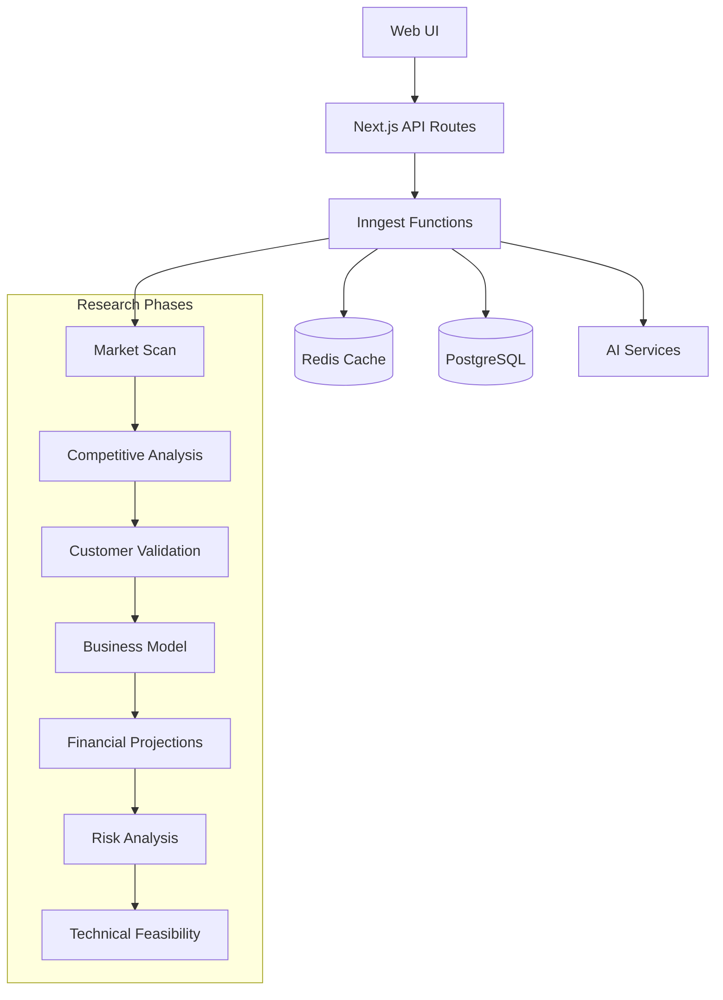
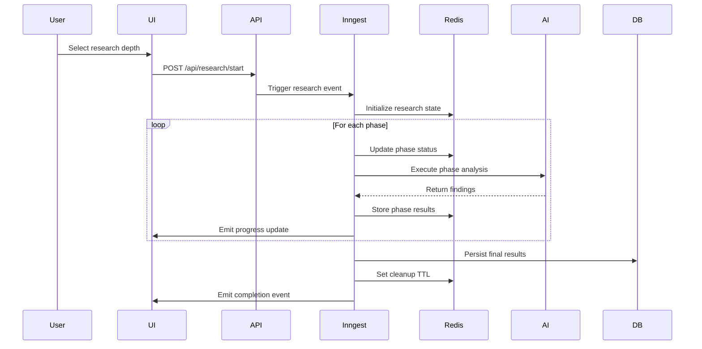

# Design Document

## Overview

The Deep Research SaaS Validation system transforms the current single-pass validation into a comprehensive, multi-phase research process. The system supports four research depths (Quick, Standard, Deep, Exhaustive) with real-time progress tracking and intelligent caching. The architecture leverages Redis for intermediate data storage and state management, while maintaining PostgreSQL for persistent storage.

## Architecture

### High-Level Architecture



### Data Flow Architecture



## Components and Interfaces

### 1. Research Configuration System

**File**: `apps/web/lib/config/researchConfig.ts`

```typescript
export interface ResearchDepthConfig {
  maxIterations: number;
  timeout: number;
  phases: ResearchPhaseType[];
  aiModel: string;
  costEstimate: number;
}

export const RESEARCH_DEPTHS = {
  QUICK: {
    maxIterations: 3,
    timeout: 300000, // 5 minutes
    phases: ["MARKET_SCAN", "COMPETITIVE_OVERVIEW"],
    aiModel: "gemini-2.0-flash",
    costEstimate: 0.05,
  },
  STANDARD: {
    maxIterations: 5,
    timeout: 600000, // 10 minutes
    phases: ["MARKET_SCAN", "COMPETITIVE_DEEP_DIVE", "CUSTOMER_VALIDATION"],
    aiModel: "gemini-2.5-flash",
    costEstimate: 0.15,
  },
  DEEP: {
    maxIterations: 10,
    timeout: 900000, // 15 minutes
    phases: [
      "MARKET_SCAN",
      "COMPETITIVE_DEEP_DIVE",
      "CUSTOMER_VALIDATION",
      "BUSINESS_MODEL",
      "FINANCIAL_PROJECTIONS",
    ],
    aiModel: "gemini-2.5-flash",
    costEstimate: 0.35,
  },
  EXHAUSTIVE: {
    maxIterations: 20,
    timeout: 1800000, // 30 minutes
    phases: [
      "MARKET_SCAN",
      "COMPETITIVE_DEEP_DIVE",
      "CUSTOMER_VALIDATION",
      "BUSINESS_MODEL",
      "FINANCIAL_PROJECTIONS",
      "RISK_ANALYSIS",
      "TECHNICAL_FEASIBILITY",
    ],
    aiModel: "gemini-2.5-flash",
    costEstimate: 0.75,
  },
} as const;
```

### 2. Type Definitions

**File**: `apps/web/types/research.ts`

```typescript
export type ResearchDepth = "QUICK" | "STANDARD" | "DEEP" | "EXHAUSTIVE";
export type ResearchPhaseType =
  | "MARKET_SCAN"
  | "COMPETITIVE_OVERVIEW"
  | "COMPETITIVE_DEEP_DIVE"
  | "CUSTOMER_VALIDATION"
  | "BUSINESS_MODEL"
  | "FINANCIAL_PROJECTIONS"
  | "RISK_ANALYSIS"
  | "TECHNICAL_FEASIBILITY";
export type PhaseStatus =
  | "PENDING"
  | "IN_PROGRESS"
  | "COMPLETED"
  | "FAILED"
  | "PAUSED";

export interface ResearchPhase {
  id: string;
  name: ResearchPhaseType;
  status: PhaseStatus;
  findings: Record<string, any>;
  questions: string[];
  confidence: number;
  duration: number;
  iterations: number;
  startedAt?: Date;
  completedAt?: Date;
  error?: string;
}

export interface ResearchSession {
  id: string;
  ideaId: string;
  organizationId: string;
  depth: ResearchDepth;
  status: "INITIALIZING" | "IN_PROGRESS" | "PAUSED" | "COMPLETED" | "FAILED";
  phases: ResearchPhase[];
  currentPhaseIndex: number;
  overallConfidence: number;
  estimatedCompletion: Date;
  actualCompletion?: Date;
  totalCost: number;
  createdAt: Date;
  updatedAt: Date;
}

export interface ResearchProgress {
  sessionId: string;
  currentPhase: ResearchPhaseType;
  phaseProgress: number; // 0-100
  overallProgress: number; // 0-100
  estimatedTimeRemaining: number; // milliseconds
  completedPhases: ResearchPhaseType[];
  failedPhases: ResearchPhaseType[];
}
```

### 3. Redis State Management

**File**: `apps/web/lib/redis/researchState.ts`

```typescript
export class ResearchStateManager {
  private redis: Redis;

  constructor(redis: Redis) {
    this.redis = redis;
  }

  // Key patterns
  private getKeys(sessionId: string) {
    return {
      session: `research:${sessionId}:session`,
      phase: (phaseId: string) => `research:${sessionId}:phase:${phaseId}`,
      progress: `research:${sessionId}:progress`,
      findings: (phaseId: string) =>
        `research:${sessionId}:findings:${phaseId}`,
      questions: (phaseId: string) =>
        `research:${sessionId}:questions:${phaseId}`,
      lock: `research:${sessionId}:lock`,
    };
  }

  async initializeSession(session: ResearchSession): Promise<void> {
    const keys = this.getKeys(session.id);
    const ttl = this.getTTL(session.depth);

    await this.redis
      .pipeline()
      .hset(keys.session, session)
      .expire(keys.session, ttl)
      .exec();
  }

  async updatePhaseStatus(
    sessionId: string,
    phaseId: string,
    status: PhaseStatus
  ): Promise<void> {
    const keys = this.getKeys(sessionId);
    await this.redis.hset(
      keys.phase(phaseId),
      "status",
      status,
      "updatedAt",
      Date.now()
    );
  }

  async storePhaseFindings(
    sessionId: string,
    phaseId: string,
    findings: any
  ): Promise<void> {
    const keys = this.getKeys(sessionId);
    await this.redis.hset(keys.findings(phaseId), findings);
  }

  async getSessionState(sessionId: string): Promise<ResearchSession | null> {
    const keys = this.getKeys(sessionId);
    const session = await this.redis.hgetall(keys.session);
    return session ? JSON.parse(session.data) : null;
  }

  private getTTL(depth: ResearchDepth): number {
    const ttlMap = {
      QUICK: 7200, // 2 hours
      STANDARD: 14400, // 4 hours
      DEEP: 28800, // 8 hours
      EXHAUSTIVE: 86400, // 24 hours
    };
    return ttlMap[depth];
  }
}
```

### 4. Enhanced Research Orchestrator

**File**: `apps/web/inngest/orchestrator/researchOrchestrator.ts`

```typescript
export class ResearchOrchestrator {
  private stateManager: ResearchStateManager;
  private phaseAnalyzers: Map<ResearchPhaseType, PhaseAnalyzer>;

  constructor(stateManager: ResearchStateManager) {
    this.stateManager = stateManager;
    this.initializeAnalyzers();
  }

  async executeResearch(sessionId: string): Promise<ResearchSession> {
    const session = await this.stateManager.getSessionState(sessionId);
    if (!session) throw new Error("Research session not found");

    try {
      await this.stateManager.updateSessionStatus(sessionId, "IN_PROGRESS");

      for (let i = session.currentPhaseIndex; i < session.phases.length; i++) {
        const phase = session.phases[i];

        await this.executePhase(sessionId, phase);

        // Check if session was paused
        const currentSession =
          await this.stateManager.getSessionState(sessionId);
        if (currentSession?.status === "PAUSED") {
          break;
        }

        session.currentPhaseIndex = i + 1;
        await this.stateManager.updateSession(sessionId, session);
      }

      await this.stateManager.updateSessionStatus(sessionId, "COMPLETED");
      return session;
    } catch (error) {
      await this.stateManager.updateSessionStatus(sessionId, "FAILED");
      throw error;
    }
  }

  private async executePhase(
    sessionId: string,
    phase: ResearchPhase
  ): Promise<void> {
    const analyzer = this.phaseAnalyzers.get(phase.name);
    if (!analyzer)
      throw new Error(`No analyzer found for phase: ${phase.name}`);

    await this.stateManager.updatePhaseStatus(
      sessionId,
      phase.id,
      "IN_PROGRESS"
    );

    try {
      const result = await analyzer.analyze(sessionId, phase);

      phase.findings = result.findings;
      phase.confidence = result.confidence;
      phase.status = "COMPLETED";
      phase.completedAt = new Date();

      await this.stateManager.storePhaseFindings(
        sessionId,
        phase.id,
        result.findings
      );
      await this.stateManager.updatePhaseStatus(
        sessionId,
        phase.id,
        "COMPLETED"
      );
    } catch (error) {
      phase.status = "FAILED";
      phase.error = error.message;
      await this.stateManager.updatePhaseStatus(sessionId, phase.id, "FAILED");
      throw error;
    }
  }

  private initializeAnalyzers(): void {
    this.phaseAnalyzers = new Map([
      ["MARKET_SCAN", new MarketScanAnalyzer()],
      ["COMPETITIVE_OVERVIEW", new CompetitiveOverviewAnalyzer()],
      ["COMPETITIVE_DEEP_DIVE", new CompetitiveDeepDiveAnalyzer()],
      ["CUSTOMER_VALIDATION", new CustomerValidationAnalyzer()],
      ["BUSINESS_MODEL", new BusinessModelAnalyzer()],
      ["FINANCIAL_PROJECTIONS", new FinancialProjectionsAnalyzer()],
      ["RISK_ANALYSIS", new RiskAnalysisAnalyzer()],
      ["TECHNICAL_FEASIBILITY", new TechnicalFeasibilityAnalyzer()],
    ]);
  }
}
```

### 5. Phase Analyzer Base Class

**File**: `apps/web/inngest/analyzers/baseAnalyzer.ts`

```typescript
export abstract class PhaseAnalyzer {
  protected maxIterations: number = 5;
  protected minConfidence: number = 70;

  abstract analyze(
    sessionId: string,
    phase: ResearchPhase
  ): Promise<AnalysisResult>;

  protected async iterativeAnalysis(
    sessionId: string,
    phase: ResearchPhase,
    initialPrompt: string,
    context: any
  ): Promise<AnalysisResult> {
    let findings: any = {};
    let confidence = 0;
    let iteration = 0;

    while (iteration < this.maxIterations && confidence < this.minConfidence) {
      const prompt =
        iteration === 0
          ? initialPrompt
          : this.generateFollowUpPrompt(findings, context);

      try {
        const response = await this.callAI(prompt, context);
        findings = this.mergeFindings(findings, response.findings);
        confidence = this.calculateConfidence(findings, iteration);

        iteration++;

        // Store intermediate results
        await this.storeIterationResult(
          sessionId,
          phase.id,
          iteration,
          findings,
          confidence
        );
      } catch (error) {
        console.error(`Analysis iteration ${iteration} failed:`, error);
        break;
      }
    }

    return {
      findings,
      confidence: Math.min(confidence, 100),
      iterations: iteration,
    };
  }

  protected abstract generateFollowUpPrompt(
    currentFindings: any,
    context: any
  ): string;
  protected abstract calculateConfidence(
    findings: any,
    iteration: number
  ): number;
  protected abstract mergeFindings(existing: any, newFindings: any): any;

  private async callAI(prompt: string, context: any): Promise<any> {
    // Implementation for AI API calls with retry logic
    const maxRetries = 3;
    let attempt = 0;

    while (attempt < maxRetries) {
      try {
        // AI API call implementation
        return await this.makeAIRequest(prompt, context);
      } catch (error) {
        attempt++;
        if (attempt >= maxRetries) throw error;
        await this.delay(Math.pow(2, attempt) * 1000); // Exponential backoff
      }
    }
  }

  private async makeAIRequest(prompt: string, context: any): Promise<any> {
    // Actual AI API implementation
    throw new Error("Must be implemented by subclass");
  }

  private delay(ms: number): Promise<void> {
    return new Promise((resolve) => setTimeout(resolve, ms));
  }

  private async storeIterationResult(
    sessionId: string,
    phaseId: string,
    iteration: number,
    findings: any,
    confidence: number
  ): Promise<void> {
    // Store iteration results in Redis for debugging and progress tracking
  }
}

export interface AnalysisResult {
  findings: any;
  confidence: number;
  iterations: number;
}
```

## Data Models

### Database Schema Updates

**File**: `packages/backend/prisma/schema.prisma`

```prisma
model ResearchSession {
  id                String              @id @default(cuid())
  ideaId            String
  organizationId    String
  depth             ResearchDepth
  status            ResearchStatus
  currentPhaseIndex Int                 @default(0)
  overallConfidence Float               @default(0)
  estimatedCompletion DateTime?
  actualCompletion  DateTime?
  totalCost         Float               @default(0)
  createdAt         DateTime            @default(now())
  updatedAt         DateTime            @updatedAt

  idea              Idea                @relation(fields: [ideaId], references: [id])
  organization      Organization        @relation(fields: [organizationId], references: [id])
  phases            ResearchPhaseResult[]

  @@map("research_sessions")
}

model ResearchPhaseResult {
  id            String              @id @default(cuid())
  sessionId     String
  phaseName     ResearchPhaseType
  status        PhaseStatus
  findings      Json
  confidence    Float               @default(0)
  duration      Int                 @default(0)
  iterations    Int                 @default(0)
  startedAt     DateTime?
  completedAt   DateTime?
  error         String?
  createdAt     DateTime            @default(now())
  updatedAt     DateTime            @updatedAt

  session       ResearchSession     @relation(fields: [sessionId], references: [id])

  @@map("research_phase_results")
}

enum ResearchDepth {
  QUICK
  STANDARD
  DEEP
  EXHAUSTIVE
}

enum ResearchStatus {
  INITIALIZING
  IN_PROGRESS
  PAUSED
  COMPLETED
  FAILED
}

enum ResearchPhaseType {
  MARKET_SCAN
  COMPETITIVE_OVERVIEW
  COMPETITIVE_DEEP_DIVE
  CUSTOMER_VALIDATION
  BUSINESS_MODEL
  FINANCIAL_PROJECTIONS
  RISK_ANALYSIS
  TECHNICAL_FEASIBILITY
}

enum PhaseStatus {
  PENDING
  IN_PROGRESS
  COMPLETED
  FAILED
  PAUSED
}
```

## Error Handling

### Circuit Breaker Implementation

**File**: `apps/web/lib/circuitBreaker.ts`

```typescript
export class CircuitBreaker {
  private failures: number = 0;
  private lastFailureTime: number = 0;
  private state: "CLOSED" | "OPEN" | "HALF_OPEN" = "CLOSED";

  constructor(
    private failureThreshold: number = 5,
    private recoveryTimeout: number = 60000
  ) {}

  async execute<T>(operation: () => Promise<T>): Promise<T> {
    if (this.state === "OPEN") {
      if (Date.now() - this.lastFailureTime > this.recoveryTimeout) {
        this.state = "HALF_OPEN";
      } else {
        throw new Error("Circuit breaker is OPEN");
      }
    }

    try {
      const result = await operation();
      this.onSuccess();
      return result;
    } catch (error) {
      this.onFailure();
      throw error;
    }
  }

  private onSuccess(): void {
    this.failures = 0;
    this.state = "CLOSED";
  }

  private onFailure(): void {
    this.failures++;
    this.lastFailureTime = Date.now();

    if (this.failures >= this.failureThreshold) {
      this.state = "OPEN";
    }
  }
}
```

## Testing Strategy

### Unit Testing Approach

- **Phase Analyzers**: Mock AI responses and test confidence calculation logic
- **State Management**: Test Redis operations with Redis mock
- **Orchestration**: Test phase transitions and error handling
- **Circuit Breaker**: Test failure scenarios and recovery

### Integration Testing

- **End-to-End Research Flow**: Test complete research sessions
- **Redis Failover**: Test database fallback scenarios
- **Concurrent Sessions**: Test multiple simultaneous research sessions

### Performance Testing

- **Load Testing**: Simulate multiple concurrent research sessions
- **Memory Usage**: Monitor Redis memory consumption
- **AI API Rate Limits**: Test behavior under API constraints

## Migration Plan

### Phase 1: Infrastructure Setup

1. Deploy Redis instance with appropriate configuration
2. Update database schema with new models
3. Create configuration management system

### Phase 2: Core Implementation

1. Implement base analyzer classes and orchestration
2. Create Redis state management layer
3. Build API endpoints for research management

### Phase 3: UI Integration

1. Create progress tracking components
2. Implement pause/resume functionality
3. Add research depth selection interface

### Phase 4: Production Rollout

1. Deploy with feature flags for gradual rollout
2. Monitor performance and adjust configurations
3. Migrate existing validation data if needed
