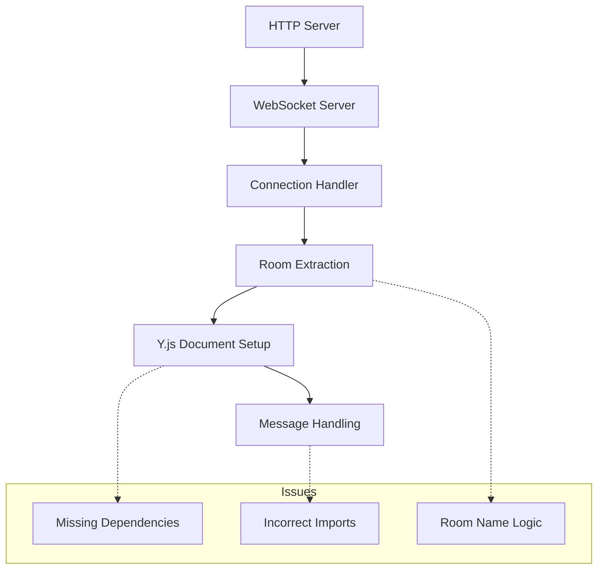
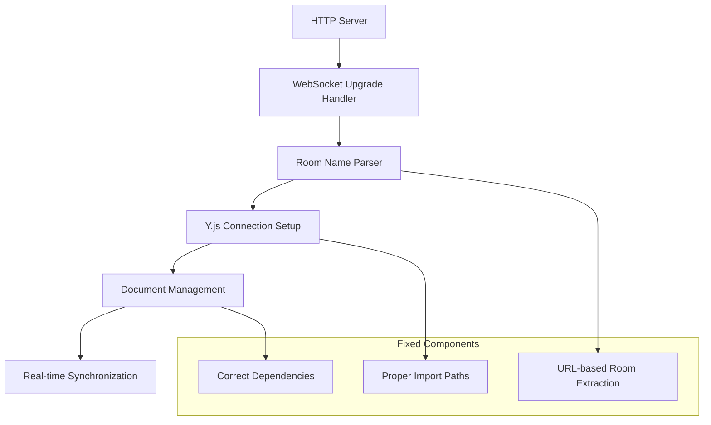
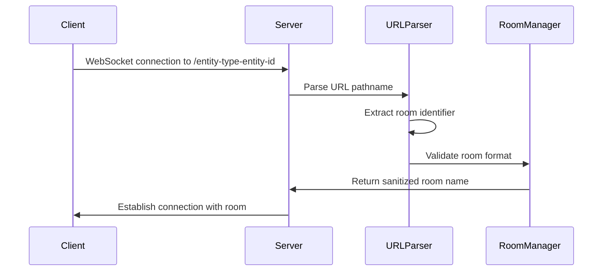
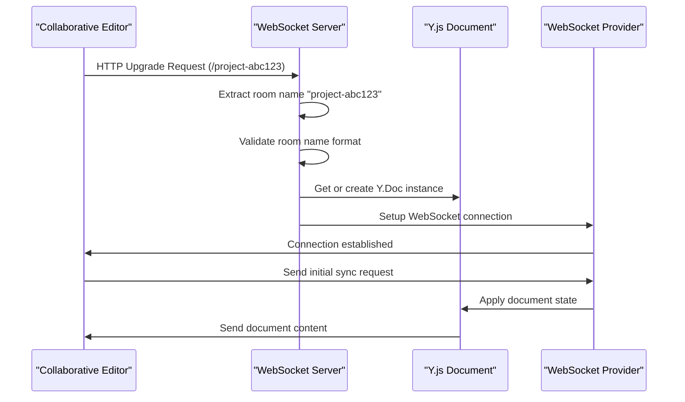
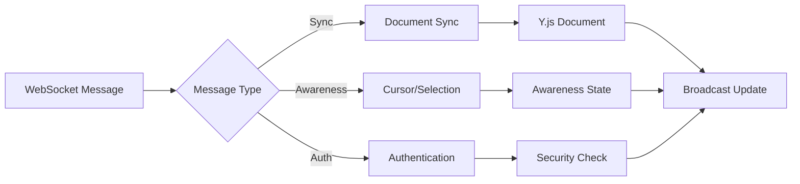
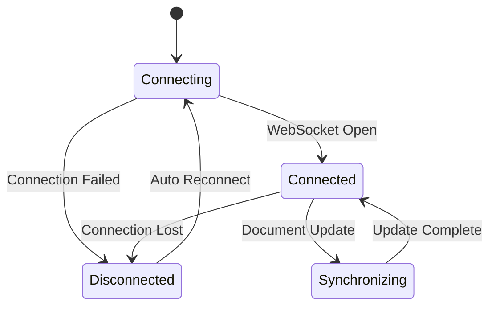
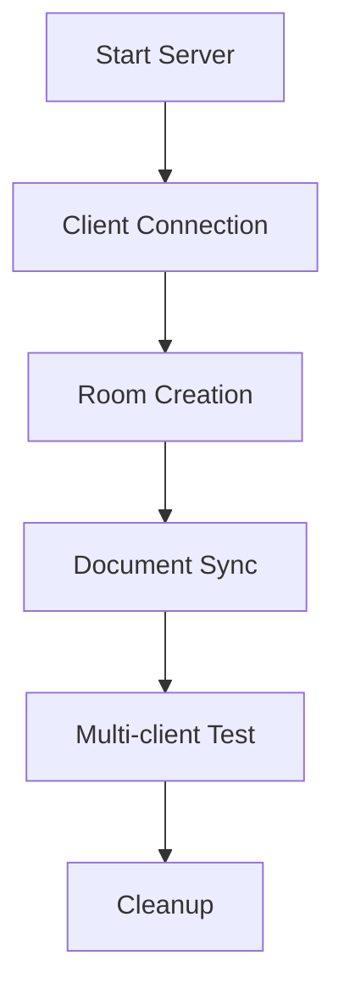

# WebSocket Server Fix: Package Dependencies and Room Management

## Overview

This design addresses critical issues in the Ray project's WebSocket server implementation for Y.js collaborative editing. The server currently has missing dependencies, incorrect import statements, and lacks proper room name extraction from client connections.

**Primary Issues Identified:**

1. Missing package dependencies in package.json
2. Incorrect import paths and module references
3. Room name extraction not properly implemented
4. TypeScript compilation errors due to import mismatches
5. Inconsistent use of Y.js protocols and utilities

## Architecture

### Current WebSocket Server Structure



### Target Architecture



## Package Dependencies Analysis

### Current Dependencies Issues

| Package        | Current Status        | Required Version    | Issue              |
| -------------- | --------------------- | ------------------- | ------------------ |
| `@y/protocols` | Referenced in imports | Not in package.json | Import error       |
| `y-protocols`  | Listed as dependency  | ^1.0.6              | Wrong package name |
| `lib0`         | Correctly listed      | ^0.2.97             | ✓ Correct          |
| `yjs`          | Correctly listed      | ^13.6.27            | ✓ Correct          |
| `ws`           | Correctly listed      | ^8.18.0             | ✓ Correct          |

### Fixed Dependencies Structure

```json
{
  "dependencies": {
    "yjs": "^13.6.27",
    "y-websocket": "^2.0.4",
    "y-protocols": "^1.0.6",
    "ws": "^8.18.0",
    "lib0": "^0.2.97"
  }
}
```

## Import Path Corrections

### Current Import Issues

```typescript
// ❌ Incorrect - '@y/protocols' doesn't exist
import * as syncProtocol from "@y/protocols/sync";
import * as awarenessProtocol from "@y/protocols/awareness";

// ❌ Incorrect module reference
import { callbackHandler, isCallbackSet } from "./callback.js";
```

### Corrected Import Structure

```typescript
// ✅ Correct - 'y-protocols' package
import * as syncProtocol from "y-protocols/sync";
import * as awarenessProtocol from "y-protocols/awareness";

// ✅ Correct module reference for TypeScript
import { callbackHandler, isCallbackSet } from "./callback.ts";
```

## Room Name Extraction Implementation

### Current Implementation Analysis

The current server extracts room names from URL paths but has limitations:

```typescript
// Current approach in server.ts
const url = new URL(request.url || "/", `http://${request.headers.host}`);
const roomName = url.pathname.slice(1); // Remove leading slash
```

### Enhanced Room Name Management



### Room Name Validation Logic

```typescript
interface RoomNameConfig {
  pattern: RegExp;
  maxLength: number;
  allowedChars: RegExp;
}

const ROOM_CONFIG: RoomNameConfig = {
  pattern: /^[\w\-]+$/,
  maxLength: 100,
  allowedChars: /^[a-zA-Z0-9\-_]+$/,
};
```

## WebSocket Connection Flow

### Connection Establishment Process



### Message Handling Architecture



## File Structure Corrections

### Current File Issues

```
src/
├── callback.ts     ✓ Correct
├── server.ts       ❌ Import issues
└── utils.ts        ❌ Import issues
```

### Fixed Server Entry Point

```typescript
// server.ts - Corrected implementation
#!/usr/bin/env node

import WebSocket from "ws";
import http from "http";
import * as number from "lib0/number";
import { setupWSConnection } from "./utils.js";

const wss = new WebSocket.Server({ noServer: true });
const host = process.env.HOST || "localhost";
const port = number.parseInt(process.env.PORT || "1234");

// Enhanced room name extraction
function extractRoomName(url: string): string {
  const pathname = new URL(url, 'http://localhost').pathname;
  const roomName = pathname.slice(1).split('?')[0];

  // Validate room name format
  if (!roomName || roomName.length > 100 || !/^[\w\-]+$/.test(roomName)) {
    return 'default-room';
  }

  return roomName;
}

const server = http.createServer((_request, response) => {
  response.writeHead(200, { "Content-Type": "text/plain" });
  response.end("WebSocket server running");
});

wss.on("connection", setupWSConnection);

server.on("upgrade", (request, socket, head) => {
  const roomName = extractRoomName(request.url || "/");
  console.log(`WebSocket connection request for room: ${roomName}`);

  wss.handleUpgrade(request, socket, head, (ws) => {
    wss.emit("connection", ws, request);
  });
});

server.listen(port, host, () => {
  console.log(`Y.js WebSocket server running at ws://${host}:${port}`);
});
```

## Client Integration Updates

### Collaborative Editor Connection

The client-side collaborative editor needs to properly construct WebSocket URLs:

```typescript
// Enhanced WebSocket URL construction
const constructWebSocketUrl = (
  entityType: string,
  entityId: string
): string => {
  const baseUrl =
    process.env.NEXT_PUBLIC_WEBSOCKET_URL || "ws://localhost:1234";
  const roomName = `${entityType}-${entityId}`;

  // Ensure proper URL format
  const wsUrl = baseUrl.endsWith("/")
    ? `${baseUrl}${roomName}`
    : `${baseUrl}/${roomName}`;

  return wsUrl;
};
```

### Connection Status Management



## Error Handling Strategy

### Connection Error Management

```typescript
interface ConnectionError {
  type: "WEBSOCKET_ERROR" | "YJS_ERROR" | "ROOM_ERROR";
  message: string;
  recoverable: boolean;
  roomName?: string;
}

class WebSocketErrorHandler {
  handleConnectionError(error: ConnectionError): void {
    console.error(`[${error.type}] ${error.message}`, {
      roomName: error.roomName,
    });

    if (error.recoverable) {
      this.scheduleReconnection();
    }
  }

  private scheduleReconnection(): void {
    setTimeout(() => {
      // Reconnection logic
    }, 3000);
  }
}
```

## Testing Strategy

### Unit Testing Requirements

```typescript
describe("WebSocket Server", () => {
  describe("Room Name Extraction", () => {
    it("should extract room name from URL path");
    it("should handle invalid room names");
    it("should sanitize special characters");
  });

  describe("Y.js Integration", () => {
    it("should create Y.Doc instances for rooms");
    it("should handle document synchronization");
    it("should manage awareness states");
  });
});
```

### Integration Testing


