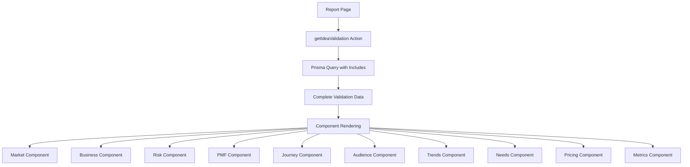
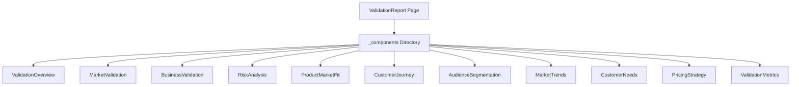

# Idea Validation Report Design

## Overview

This design document outlines the implementation of a comprehensive validation report page that fetches and displays complete idea validation data from the Prisma database. The report will present validation insights in a clean, report-style interface using shadcn components and Tailwind CSS, avoiding charts while maintaining excellent UX.

## Repository Type

**Full-Stack Application** - Ray is a modern monorepo containing both frontend (Next.js) and backend (Prisma/PostgreSQL) components with extensive validation data models.

## Architecture

### Data Flow Architecture



### Component Architecture



## Data Models & Schema

### Core Validation Models

The system uses the following Prisma models for comprehensive validation data:

**Primary Model**

- `IdeaValidation` - Main validation container with overall scores and status

**Analysis Modules**

- `MarketValidation` - Market size, growth, and opportunities
- `BusinessValidation` - Revenue model, unit economics, projections
- `RiskAnalysis` - Risk assessment and mitigation strategies
- `ProductMarketFitAnalysis` - PMF metrics and feedback

**Deep Research Modules**

- `CustomerJourneyMapping` - Journey stages and touchpoints
- `TargetAudienceSegmentation` - Audience segments and characteristics
- `MarketTrendAnalysis` - Market trends and opportunities
- `CustomerNeedAnalysis` - Customer needs and pain points
- `PricingStrategyAnalysis` - Pricing tiers and competitive analysis

**Supporting Models**

- `ValidationMetrics` - Consolidated metrics and KPIs
- `MarketInsight[]` - Market insights with impact scores
- `BusinessInsight[]` - Business insights and opportunities
- `RiskItem[]` - Individual risk items with mitigation
- `PMFMetric[]` - Product-market fit metrics
- `JourneyStage[]` - Customer journey stages
- `AudienceSegment[]` - Target audience segments
- `MarketTrend[]` - Market trends analysis
- `CustomerNeed[]` - Customer needs assessment
- `PricingTier[]` - Pricing tier analysis

## API Integration Layer

### TanStack Query Integration

Using TanStack Query for efficient data fetching with individual component-level queries:

```typescript
// actions/idea/validation-report.ts

// Base validation data
export async function getIdeaValidation(ideaId: string) {
  await getSession();
  return await prisma.ideaValidation.findUnique({
    where: { ideaId },
    include: {
      idea: true,
      validationMetrics: true,
    },
  });
}

// Individual module queries for component-level fetching
export async function getMarketValidation(ideaId: string) {
  await getSession();
  const validation = await prisma.ideaValidation.findUnique({
    where: { ideaId },
    include: {
      marketValidation: {
        include: {
          marketInsights: true,
          regionScores: true,
        },
      },
    },
  });
  return validation?.marketValidation;
}

export async function getBusinessValidation(ideaId: string) {
  await getSession();
  const validation = await prisma.ideaValidation.findUnique({
    where: { ideaId },
    include: {
      businessValidation: {
        include: {
          businessInsights: true,
          monthlyProjections: true,
          acquisitionChannels: true,
        },
      },
    },
  });
  return validation?.businessValidation;
}

export async function getRiskAnalysis(ideaId: string) {
  await getSession();
  const validation = await prisma.ideaValidation.findUnique({
    where: { ideaId },
    include: {
      riskAnalysis: {
        include: {
          riskItems: true,
        },
      },
    },
  });
  return validation?.riskAnalysis;
}

export async function getProductMarketFitAnalysis(ideaId: string) {
  await getSession();
  const validation = await prisma.ideaValidation.findUnique({
    where: { ideaId },
    include: {
      productMarketFitAnalysis: {
        include: {
          metrics: true,
          feedback: true,
        },
      },
    },
  });
  return validation?.productMarketFitAnalysis;
}

export async function getCustomerJourney(ideaId: string) {
  await getSession();
  const validation = await prisma.ideaValidation.findUnique({
    where: { ideaId },
    include: {
      CustomerJourneyMapping: {
        include: {
          journeyStages: true,
          touchpoints: true,
          journeyPainPoints: true,
        },
      },
    },
  });
  return validation?.CustomerJourneyMapping;
}

export async function getAudienceSegmentation(ideaId: string) {
  await getSession();
  const validation = await prisma.ideaValidation.findUnique({
    where: { ideaId },
    include: {
      TargetAudienceSegmentation: {
        include: {
          audienceSegments: true,
        },
      },
    },
  });
  return validation?.TargetAudienceSegmentation;
}

export async function getMarketTrends(ideaId: string) {
  await getSession();
  const validation = await prisma.ideaValidation.findUnique({
    where: { ideaId },
    include: {
      MarketTrendAnalysis: {
        include: {
          marketTrends: true,
        },
      },
    },
  });
  return validation?.MarketTrendAnalysis;
}

export async function getCustomerNeeds(ideaId: string) {
  await getSession();
  const validation = await prisma.ideaValidation.findUnique({
    where: { ideaId },
    include: {
      CustomerNeedAnalysis: {
        include: {
          customerNeeds: true,
          painPoints: true,
        },
      },
    },
  });
  return validation?.CustomerNeedAnalysis;
}

export async function getPricingStrategy(ideaId: string) {
  await getSession();
  const validation = await prisma.ideaValidation.findUnique({
    where: { ideaId },
    include: {
      PricingStrategyAnalysis: {
        include: {
          pricingTiers: true,
          competitorPricing: true,
        },
      },
    },
  });
  return validation?.PricingStrategyAnalysis;
}
```

### Query Keys and Hooks

```typescript
// lib/queries/validation.ts
export const validationKeys = {
  all: ["validation"] as const,
  idea: (ideaId: string) => [...validationKeys.all, ideaId] as const,
  overview: (ideaId: string) =>
    [...validationKeys.idea(ideaId), "overview"] as const,
  market: (ideaId: string) =>
    [...validationKeys.idea(ideaId), "market"] as const,
  business: (ideaId: string) =>
    [...validationKeys.idea(ideaId), "business"] as const,
  risk: (ideaId: string) => [...validationKeys.idea(ideaId), "risk"] as const,
  pmf: (ideaId: string) => [...validationKeys.idea(ideaId), "pmf"] as const,
  journey: (ideaId: string) =>
    [...validationKeys.idea(ideaId), "journey"] as const,
  audience: (ideaId: string) =>
    [...validationKeys.idea(ideaId), "audience"] as const,
  trends: (ideaId: string) =>
    [...validationKeys.idea(ideaId), "trends"] as const,
  needs: (ideaId: string) => [...validationKeys.idea(ideaId), "needs"] as const,
  pricing: (ideaId: string) =>
    [...validationKeys.idea(ideaId), "pricing"] as const,
};

// Custom hooks for each validation module
export const useValidationOverview = (ideaId: string) => {
  return useQuery({
    queryKey: validationKeys.overview(ideaId),
    queryFn: () => getIdeaValidation(ideaId),
    enabled: !!ideaId,
  });
};

export const useMarketValidation = (ideaId: string) => {
  return useQuery({
    queryKey: validationKeys.market(ideaId),
    queryFn: () => getMarketValidation(ideaId),
    enabled: !!ideaId,
  });
};

export const useBusinessValidation = (ideaId: string) => {
  return useQuery({
    queryKey: validationKeys.business(ideaId),
    queryFn: () => getBusinessValidation(ideaId),
    enabled: !!ideaId,
  });
};

export const useRiskAnalysis = (ideaId: string) => {
  return useQuery({
    queryKey: validationKeys.risk(ideaId),
    queryFn: () => getRiskAnalysis(ideaId),
    enabled: !!ideaId,
  });
};

export const useProductMarketFit = (ideaId: string) => {
  return useQuery({
    queryKey: validationKeys.pmf(ideaId),
    queryFn: () => getProductMarketFitAnalysis(ideaId),
    enabled: !!ideaId,
  });
};

export const useCustomerJourney = (ideaId: string) => {
  return useQuery({
    queryKey: validationKeys.journey(ideaId),
    queryFn: () => getCustomerJourney(ideaId),
    enabled: !!ideaId,
  });
};

export const useAudienceSegmentation = (ideaId: string) => {
  return useQuery({
    queryKey: validationKeys.audience(ideaId),
    queryFn: () => getAudienceSegmentation(ideaId),
    enabled: !!ideaId,
  });
};

export const useMarketTrends = (ideaId: string) => {
  return useQuery({
    queryKey: validationKeys.trends(ideaId),
    queryFn: () => getMarketTrends(ideaId),
    enabled: !!ideaId,
  });
};

export const useCustomerNeeds = (ideaId: string) => {
  return useQuery({
    queryKey: validationKeys.needs(ideaId),
    queryFn: () => getCustomerNeeds(ideaId),
    enabled: !!ideaId,
  });
};

export const usePricingStrategy = (ideaId: string) => {
  return useQuery({
    queryKey: validationKeys.pricing(ideaId),
    queryFn: () => getPricingStrategy(ideaId),
    enabled: !!ideaId,
  });
};
```

## Component Architecture

### Main Page Structure

```typescript
// app/(dashboard)/ideas/[id]/report/page.tsx
interface ValidationReportProps {
  params: Promise<{ id: string }>;
}

const ValidationReport = async ({ params }: ValidationReportProps) => {
  const { id } = await params;

  return (
    <div className="space-y-8">
      <ValidationHeader ideaId={id} />
      <ValidationOverview ideaId={id} />

      <div className="space-y-6">
        <MarketValidation ideaId={id} />
        <BusinessValidation ideaId={id} />
        <RiskAnalysis ideaId={id} />
        <ProductMarketFit ideaId={id} />
        <CustomerJourney ideaId={id} />
        <AudienceSegmentation ideaId={id} />
        <MarketTrends ideaId={id} />
        <CustomerNeeds ideaId={id} />
        <PricingStrategy ideaId={id} />
        <ValidationMetrics ideaId={id} />
      </div>
    </div>
  );
};
```

### Component Directory Structure

```
app/(dashboard)/ideas/[id]/report/
├── page.tsx                    # Main report page
└── _components/
    ├── ValidationHeader.tsx    # Report header with overall scores
    ├── ValidationOverview.tsx  # Executive summary
    ├── MarketValidation.tsx    # Market analysis display
    ├── BusinessValidation.tsx  # Business model analysis
    ├── RiskAnalysis.tsx        # Risk assessment display
    ├── ProductMarketFit.tsx    # PMF metrics and feedback
    ├── CustomerJourney.tsx     # Journey mapping display
    ├── AudienceSegmentation.tsx # Target audience analysis
    ├── MarketTrends.tsx        # Market trends display
    ├── CustomerNeeds.tsx       # Customer needs analysis
    ├── PricingStrategy.tsx     # Pricing analysis display
    ├── ValidationMetrics.tsx   # Consolidated metrics
    ├── ValidationNotFound.tsx  # Error state component
    └── shared/
        ├── ScoreCard.tsx       # Reusable score display
        ├── InsightCard.tsx     # Reusable insight display
        ├── MetricCard.tsx      # Reusable metric display
        └── SectionHeader.tsx   # Reusable section header
```

## UI Component Design

### Design System Compliance

All components follow shadcn design system principles:

- Use semantic color classes (`bg-muted`, `text-foreground`)
- Consistent spacing with `space-y-3` patterns
- Minimalist design approach
- Clean typography hierarchy
- Proper responsive design

### Component Interface Patterns

#### Validation Header Component

```typescript
interface ValidationHeaderProps {
  ideaId: string;
}

const ValidationHeader = ({ ideaId }: ValidationHeaderProps) => {
  const { data: validation, isLoading, error } = useValidationOverview(ideaId);

  if (isLoading) {
    return (
      <div className="space-y-4">
        <div className="flex items-center justify-between">
          <div className="space-y-2">
            <Skeleton className="h-8 w-64" />
            <Skeleton className="h-4 w-32" />
          </div>
          <div className="flex items-center gap-4">
            <Skeleton className="h-16 w-24" />
            <Skeleton className="h-16 w-24" />
          </div>
        </div>
        <div className="grid grid-cols-1 md:grid-cols-3 gap-4">
          <Skeleton className="h-16 w-full" />
          <Skeleton className="h-16 w-full" />
          <Skeleton className="h-16 w-full" />
        </div>
      </div>
    );
  }

  if (error || !validation) {
    return <ValidationNotFound />;
  }

  return (
    <div className="space-y-4">
      <div className="flex items-center justify-between">
        <div>
          <h1 className="text-2xl font-bold">{validation.idea.name}</h1>
          <p className="text-muted-foreground">Validation Report</p>
        </div>
        <div className="flex items-center gap-4">
          <ScoreCard
            label="Overall Score"
            value={validation.overallScore}
            maxValue={100}
          />
          <ScoreCard
            label="Confidence"
            value={validation.confidenceLevel}
            maxValue={100}
          />
        </div>
      </div>

      <div className="grid grid-cols-1 md:grid-cols-3 gap-4">
        <MetricCard
          label="Validation Status"
          value={validation.overallStatus}
          variant="status"
        />
        <MetricCard
          label="Progress"
          value={`${validation.validationProgress}%`}
          variant="percentage"
        />
        <MetricCard
          label="Completed"
          value={validation.completedAt ? format(validation.completedAt, 'MMM dd, yyyy') : 'In Progress'}
          variant="date"
        />
      </div>
    </div>
  );
};
```

#### Market Validation Component

```typescript
interface MarketValidationProps {
  ideaId: string;
}

const MarketValidation = ({ ideaId }: MarketValidationProps) => {
  const { data, isLoading, error } = useMarketValidation(ideaId);

  if (isLoading) {
    return (
      <div className="border rounded-lg bg-background">
        <div className="p-6 border-b">
          <Skeleton className="h-6 w-32" />
        </div>
        <div className="p-6 space-y-6">
          <div className="grid grid-cols-1 md:grid-cols-3 gap-4">
            <Skeleton className="h-16 w-full" />
            <Skeleton className="h-16 w-full" />
            <Skeleton className="h-16 w-full" />
          </div>
          <div className="space-y-3">
            <Skeleton className="h-4 w-24" />
            <div className="grid grid-cols-1 md:grid-cols-2 gap-3">
              <Skeleton className="h-20 w-full" />
              <Skeleton className="h-20 w-full" />
            </div>
          </div>
        </div>
      </div>
    );
  }

  if (error || !data) {
    return null; // Don't render if no data
  }

  return (
    <div className="border rounded-lg bg-background">
      <div className="p-6 border-b">
        <SectionHeader
          title="Market Analysis"
          score={data.overallMarketScore}
        />
      </div>

      <div className="p-6 space-y-6">
        {/* Market Size Metrics */}
        <div className="grid grid-cols-1 md:grid-cols-3 gap-4">
          <MetricCard
            label="Total Addressable Market (TAM)"
            value={`$${data.totalAddressableMarket}M`}
          />
          <MetricCard
            label="Serviceable Addressable Market (SAM)"
            value={`$${data.serviceableAddressableMarket}M`}
          />
          <MetricCard
            label="Serviceable Obtainable Market (SOM)"
            value={`$${data.serviceableObtainableMarket}M`}
          />
        </div>

        {/* Market Insights */}
        {data.marketInsights.length > 0 && (
          <div className="space-y-3">
            <h4 className="text-sm font-medium">Market Insights</h4>
            <div className="grid grid-cols-1 md:grid-cols-2 gap-3">
              {data.marketInsights.map((insight) => (
                <InsightCard
                  key={insight.id}
                  category={insight.category}
                  impact={insight.impact}
                  urgency={insight.urgency}
                  description={insight.description}
                />
              ))}
            </div>
          </div>
        )}

        {/* Regional Scores */}
        {data.regionScores.length > 0 && (
          <div className="space-y-3">
            <h4 className="text-sm font-medium">Regional Opportunities</h4>
            <div className="grid grid-cols-2 md:grid-cols-4 gap-3">
              {data.regionScores.map((region) => (
                <MetricCard
                  key={region.id}
                  label={region.region}
                  value={region.score}
                  maxValue={100}
                  variant="score"
                />
              ))}
            </div>
          </div>
        )}
      </div>
    </div>
  );
};
```

#### Business Validation Component

```typescript
interface BusinessValidationProps {
  data: BusinessValidation & {
    businessInsights: BusinessInsight[];
    monthlyProjections: MonthlyProjection[];
    acquisitionChannels: AcquisitionChannel[];
  };
}

const BusinessValidation = ({ data }: BusinessValidationProps) => {
  return (
    <Card>
      <CardHeader>
        <SectionHeader
          title="Business Model Analysis"
          score={data.overallBusinessScore}
        />
      </CardHeader>

      <CardContent className="space-y-6">
        {/* Revenue Model */}
        <div className="grid grid-cols-1 md:grid-cols-3 gap-4">
          <MetricCard
            label="Revenue Model"
            value={data.primaryRevenueModel}
            variant="text"
          />
          <MetricCard
            label="Pricing Strategy"
            value={data.pricingStrategy}
            variant="text"
          />
          <MetricCard
            label="Price Point"
            value={`$${data.pricePoint}`}
          />
        </div>

        {/* Unit Economics */}
        <div className="space-y-3">
          <h4 className="text-sm font-medium">Unit Economics</h4>
          <div className="grid grid-cols-1 md:grid-cols-3 gap-4">
            <MetricCard
              label="Customer Acquisition Cost (CAC)"
              value={`$${data.customerAcquisitionCost}`}
            />
            <MetricCard
              label="Customer Lifetime Value (LTV)"
              value={`$${data.customerLifetimeValue}`}
            />
            <MetricCard
              label="Monthly Churn Rate"
              value={`${data.monthlyChurnRate}%`}
            />
          </div>
        </div>

        {/* Financial Projections */}
        {data.monthlyProjections.length > 0 && (
          <div className="space-y-3">
            <h4 className="text-sm font-medium">Financial Projections</h4>
            <div className="grid grid-cols-1 md:grid-cols-2 gap-4">
              <MetricCard
                label="Break-even Month"
                value={`Month ${data.breakEvenMonth}`}
              />
              <MetricCard
                label="Total Funding Needed"
                value={`$${data.totalFundingNeeded?.toLocaleString()}`}
              />
            </div>
          </div>
        )}

        {/* Acquisition Channels */}
        {data.acquisitionChannels.length > 0 && (
          <div className="space-y-3">
            <h4 className="text-sm font-medium">Acquisition Channels</h4>
            <div className="grid grid-cols-1 md:grid-cols-2 gap-3">
              {data.acquisitionChannels.map((channel) => (
                <div key={channel.id} className="flex justify-between items-center p-3 bg-muted rounded-lg">
                  <span className="text-sm font-medium">{channel.channel}</span>
                  <div className="text-right">
                    <div className="text-sm font-bold">{channel.effectiveness}/100</div>
                    {channel.cost && (
                      <div className="text-xs text-muted-foreground">${channel.cost} CAC</div>
                    )}
                  </div>
                </div>
              ))}
            </div>
          </div>
        )}
      </CardContent>
    </Card>
  );
};
```

#### Risk Analysis Component

```typescript
interface RiskAnalysisProps {
  data: RiskAnalysis & {
    riskItems: RiskItem[];
  };
}

const RiskAnalysis = ({ data }: RiskAnalysisProps) => {
  // Sort risks by impact * probability for priority display
  const sortedRisks = data.riskItems.sort((a, b) =>
    (b.impact * b.probability) - (a.impact * a.probability)
  );

  return (
    <Card>
      <CardHeader>
        <SectionHeader
          title="Risk Analysis"
          score={100 - data.overallRiskScore} // Invert for display
          scoreLabel="Risk Mitigation Score"
        />
      </CardHeader>

      <CardContent className="space-y-6">
        <div className="grid grid-cols-1 md:grid-cols-3 gap-4">
          <MetricCard
            label="Overall Risk Score"
            value={data.overallRiskScore}
            maxValue={100}
            variant="risk"
          />
          <MetricCard
            label="High Priority Risks"
            value={sortedRisks.filter(r => r.impact >= 4 && r.probability >= 4).length}
          />
          <MetricCard
            label="Total Risks Identified"
            value={data.riskItems.length}
          />
        </div>

        {/* Risk Items */}
        <div className="space-y-3">
          <h4 className="text-sm font-medium">Risk Assessment</h4>
          <div className="space-y-3">
            {sortedRisks.map((risk) => (
              <Card key={risk.id} className="border-l-4 border-l-red-200">
                <CardContent className="p-4">
                  <div className="flex items-start justify-between mb-2">
                    <div className="flex-1">
                      <div className="flex items-center gap-2 mb-1">
                        <Badge variant="outline">{risk.category}</Badge>
                        <span className="text-xs text-muted-foreground">
                          Impact: {risk.impact}/5 | Probability: {risk.probability}/5
                        </span>
                      </div>
                      <p className="text-sm font-medium mb-2">{risk.description}</p>
                      <p className="text-xs text-muted-foreground">{risk.mitigation}</p>
                    </div>
                    <div className="text-right">
                      <div className="text-sm font-bold text-red-600">
                        {risk.impact * risk.probability}/25
                      </div>
                      <div className="text-xs text-muted-foreground">Risk Score</div>
                    </div>
                  </div>
                </CardContent>
              </Card>
            ))}
          </div>
        </div>
      </CardContent>
    </Card>
  );
};
```

### Shared Components

#### Score Card Component

```typescript
interface ScoreCardProps {
  label: string;
  value: number;
  maxValue?: number;
  variant?: 'default' | 'risk' | 'score';
}

const ScoreCard = ({ label, value, maxValue = 100, variant = 'default' }: ScoreCardProps) => {
  const percentage = (value / maxValue) * 100;

  const getColorClass = () => {
    if (variant === 'risk') {
      if (percentage >= 70) return 'text-red-600 bg-red-50';
      if (percentage >= 40) return 'text-yellow-600 bg-yellow-50';
      return 'text-green-600 bg-green-50';
    }

    if (percentage >= 70) return 'text-green-600 bg-green-50';
    if (percentage >= 40) return 'text-yellow-600 bg-yellow-50';
    return 'text-red-600 bg-red-50';
  };

  return (
    <div className={`p-3 rounded-lg border ${getColorClass()}`}>
      <div className="text-xs font-medium text-muted-foreground mb-1">{label}</div>
      <div className="text-lg font-bold">{value}{maxValue === 100 ? '%' : ''}</div>
    </div>
  );
};
```

#### Insight Card Component

```typescript
interface InsightCardProps {
  category: string;
  impact: number;
  urgency: number;
  description?: string;
}

const InsightCard = ({ category, impact, urgency, description }: InsightCardProps) => {
  const priority = (impact + urgency) / 2;

  const getPriorityColor = () => {
    if (priority >= 70) return 'border-l-red-400 bg-red-50';
    if (priority >= 40) return 'border-l-yellow-400 bg-yellow-50';
    return 'border-l-green-400 bg-green-50';
  };

  return (
    <Card className={`border-l-4 ${getPriorityColor()}`}>
      <CardContent className="p-4">
        <div className="flex items-center justify-between mb-2">
          <Badge variant="outline" className="text-xs">{category}</Badge>
          <div className="text-xs text-muted-foreground">
            Priority: {Math.round(priority)}/100
          </div>
        </div>
        {description && (
          <p className="text-sm">{description}</p>
        )}
        <div className="flex gap-4 mt-2 text-xs text-muted-foreground">
          <span>Impact: {impact}/100</span>
          <span>Urgency: {urgency}/100</span>
        </div>
      </CardContent>
    </Card>
  );
};
```

## Testing Strategy

### Unit Testing with TanStack Query

Test components with mocked query responses:

```typescript
// __tests__/ValidationReport.test.tsx
const createQueryClient = () => new QueryClient({
  defaultOptions: {
    queries: { retry: false },
    mutations: { retry: false },
  },
});

const renderWithQueryClient = (component: React.ReactElement) => {
  const queryClient = createQueryClient();
  return render(
    <QueryClientProvider client={queryClient}>
      {component}
    </QueryClientProvider>
  );
};

describe('ValidationReport', () => {
  it('renders validation overview when data is available', async () => {
    const queryClient = createQueryClient();
    const mockValidation = createMockValidation();

    // Pre-populate cache with mock data
    queryClient.setQueryData(
      validationKeys.overview('test-id'),
      mockValidation
    );

    renderWithQueryClient(<ValidationHeader ideaId="test-id" />);

    expect(screen.getByText('Validation Report')).toBeInTheDocument();
    expect(screen.getByText('Overall Score')).toBeInTheDocument();
  });

  it('shows loading skeleton while fetching data', () => {
    renderWithQueryClient(<ValidationHeader ideaId="test-id" />);

    expect(screen.getByTestId('header-skeleton')).toBeInTheDocument();
  });

  it('handles error states gracefully', async () => {
    const queryClient = createQueryClient();

    // Mock failed query
    queryClient.setQueryData(
      validationKeys.overview('test-id'),
      () => { throw new Error('Failed to fetch'); }
    );

    renderWithQueryClient(<ValidationHeader ideaId="test-id" />);

    await waitFor(() => {
      expect(screen.getByText('Validation Not Found')).toBeInTheDocument();
    });
  });
});

// Component-specific tests
describe('MarketValidation', () => {
  it('displays market size metrics correctly', async () => {
    const queryClient = createQueryClient();
    const mockData = createMockMarketValidation();

    queryClient.setQueryData(
      validationKeys.market('test-id'),
      mockData
    );

    renderWithQueryClient(<MarketValidation ideaId="test-id" />);

    await waitFor(() => {
      expect(screen.getByText('Total Addressable Market (TAM)')).toBeInTheDocument();
      expect(screen.getByText('$500M')).toBeInTheDocument();
    });
  });

  it('does not render when no data is available', async () => {
    const queryClient = createQueryClient();

    queryClient.setQueryData(
      validationKeys.market('test-id'),
      null
    );

    const { container } = renderWithQueryClient(
      <MarketValidation ideaId="test-id" />
    );

    await waitFor(() => {
      expect(container.firstChild).toBeNull();
    });
  });
});
```

### Integration Testing

Test query integration with MSW (Mock Service Worker):

```typescript
// __tests__/integration/ValidationReport.integration.test.tsx
const server = setupServer(
  rest.get('/api/validation/overview/:ideaId', (req, res, ctx) => {
    return res(ctx.json(mockValidationData));
  }),
  rest.get('/api/validation/market/:ideaId', (req, res, ctx) => {
    return res(ctx.json(mockMarketData));
  })
);

beforeAll(() => server.listen());
afterEach(() => server.resetHandlers());
afterAll(() => server.close());

describe('Validation Report Integration', () => {
  it('fetches and displays complete validation data', async () => {
    renderWithQueryClient(<ValidationReport ideaId="test-idea-id" />);

    await waitFor(() => {
      expect(screen.getByText('Validation Report')).toBeInTheDocument();
      expect(screen.getByText('Market Analysis')).toBeInTheDocument();
    });
  });

  it('handles API errors gracefully', async () => {
    server.use(
      rest.get('/api/validation/overview/:ideaId', (req, res, ctx) => {
        return res(ctx.status(500), ctx.json({ error: 'Server error' }));
      })
    );

    renderWithQueryClient(<ValidationReport ideaId="test-idea-id" />);

    await waitFor(() => {
      expect(screen.getByText('Validation Not Found')).toBeInTheDocument();
    });
  });
});
```

### Query Testing Utilities

```typescript
// utils/test-utils.tsx
export const createMockQueryClient = () => {
  return new QueryClient({
    defaultOptions: {
      queries: {
        retry: false,
        cacheTime: 0,
      },
    },
  });
};

export const mockValidationQueries = (
  queryClient: QueryClient,
  ideaId: string
) => {
  queryClient.setQueryData(
    validationKeys.overview(ideaId),
    createMockValidation()
  );
  queryClient.setQueryData(
    validationKeys.market(ideaId),
    createMockMarketValidation()
  );
  queryClient.setQueryData(
    validationKeys.business(ideaId),
    createMockBusinessValidation()
  );
  // ... other mock data
};
```

## Error Handling

### Error States

```typescript
const ValidationNotFound = () => {
  return (
    <Card className="text-center py-12">
      <CardContent>
        <div className="mx-auto w-12 h-12 text-muted-foreground mb-4">
          <AlertCircle className="w-full h-full" />
        </div>
        <h3 className="text-lg font-semibold mb-2">Validation Not Found</h3>
        <p className="text-muted-foreground mb-4">
          No validation data found for this idea.
        </p>
        <Button asChild>
          <Link href={`/ideas/${id}`}>
            Back to Idea
          </Link>
        </Button>
      </CardContent>
    </Card>
  );
};
```

### Loading States

```typescript
const ValidationReportSkeleton = () => {
  return (
    <div className="space-y-8">
      <Skeleton className="h-24 w-full" />
      <div className="grid grid-cols-1 md:grid-cols-2 gap-6">
        {Array.from({ length: 6 }).map((_, i) => (
          <Skeleton key={i} className="h-64 w-full" />
        ))}
      </div>
    </div>
  );
};
```

## Performance Considerations

### TanStack Query Benefits

- **Caching**: Each component's data is cached independently, reducing duplicate API calls
- **Background Refetching**: Data stays fresh with automatic background updates
- **Error Boundaries**: Component-level error handling prevents full page crashes
- **Loading States**: Individual loading states provide better UX feedback
- **Parallel Loading**: Multiple components can fetch data simultaneously

### Data Fetching Optimization

- Component-specific queries only fetch needed data, reducing payload size
- Query invalidation strategies for real-time updates
- Optimistic updates for better perceived performance
- Stale-while-revalidate pattern for instant UI updates

### Component Optimization

- Lazy load components below the fold with React.lazy()
- Memoize expensive calculations (risk scoring, trend analysis) with useMemo
- Use proper React keys for list rendering
- Query deduplication prevents multiple identical requests

### Query Management

```typescript
// Invalidate all validation data when validation is updated
const invalidateValidationData = (queryClient: QueryClient, ideaId: string) => {
  queryClient.invalidateQueries({ queryKey: validationKeys.idea(ideaId) });
};

// Prefetch critical sections for better UX
const prefetchValidationSections = async (
  queryClient: QueryClient,
  ideaId: string
) => {
  await Promise.all([
    queryClient.prefetchQuery({
      queryKey: validationKeys.overview(ideaId),
      queryFn: () => getIdeaValidation(ideaId),
    }),
    queryClient.prefetchQuery({
      queryKey: validationKeys.market(ideaId),
      queryFn: () => getMarketValidation(ideaId),
    }),
    queryClient.prefetchQuery({
      queryKey: validationKeys.business(ideaId),
      queryFn: () => getBusinessValidation(ideaId),
    }),
  ]);
};
```

### Responsive Design

- Mobile-first approach with progressive enhancement
- Collapsible sections for mobile viewing
- Horizontal scroll for wide tables on mobile
- Optimized touch targets for mobile interaction

## Accessibility

### Screen Reader Support

- Proper semantic HTML structure
- ARIA labels for score indicators
- Clear heading hierarchy (h1 > h2 > h3)
- Alternative text for visual indicators

### Keyboard Navigation

- Tab order follows logical content flow
- Keyboard shortcuts for section navigation
- Focus indicators for interactive elements
- Skip links for lengthy content

### Color Accessibility

- High contrast color combinations
- Additional visual indicators beyond color
- Support for dark/light theme switching
- WCAG 2.1 AA compliance for color contrast
