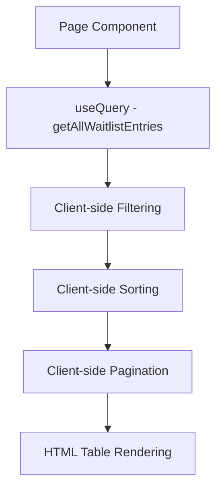
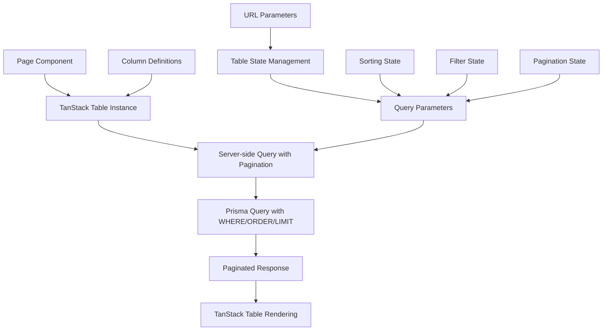
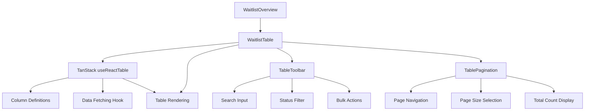

# Waitlist Overview Table Design Improvement

## Overview

This design improves the waitlist overview table implementation by migrating from the current HTML table structure to TanStack React Table with proper server-side pagination. The improvement focuses on creating a cleaner, more performant, and feature-rich table interface that aligns with modern table management best practices.

## Technology Stack & Dependencies

- **@tanstack/react-table**: v8.21.3 (already installed)
- **@tanstack/react-query**: v5.85.0 (for data fetching and state management)
- **shadcn/ui components**: Table, Pagination, Button, Input, Select, Checkbox
- **Next.js**: App Router with URL-based state management
- **Prisma**: Backend ORM for database operations

## Current State Analysis

### Existing Implementation Issues

- Manual client-side pagination with array slicing
- No proper column management
- Limited sorting capabilities
- Inefficient data fetching (loads all entries then filters client-side)
- Poor performance with large datasets
- No advanced filtering or search optimization

### Current Data Flow



## Improved Architecture Design

### Enhanced Data Flow Architecture



### Component Architecture



## API Endpoints Enhancement

### Enhanced Backend Query Structure

The existing `getFilteredWaitlistEntries` function will be improved to support:

#### Request Parameters

```typescript
interface WaitlistEntriesQuery {
  waitlistId: string;
  page?: number;
  pageSize?: number;
  search?: string;
  status?: string;
  sortBy?: string;
  sortOrder?: "asc" | "desc";
}
```

#### Response Structure

```typescript
interface PaginatedWaitlistResponse {
  success: boolean;
  data: {
    entries: WaitlistEntry[];
    pagination: {
      page: number;
      pageSize: number;
      totalCount: number;
      totalPages: number;
      hasNextPage: boolean;
      hasPreviousPage: boolean;
    };
  };
}
```

#### Optimized Prisma Query

```typescript
// Enhanced server-side implementation
const entries = await prisma.waitlistEntry.findMany({
  where: {
    waitlistId: data.waitlistId,
    ...(search && {
      OR: [
        { email: { contains: search, mode: "insensitive" } },
        { name: { contains: search, mode: "insensitive" } },
      ],
    }),
    ...(status !== "all" && { status }),
  },
  include: {
    _count: { select: { referrals: true } },
    referrals: false, // Only count, don't load full referrals
  },
  orderBy: sortBy ? { [sortBy]: sortOrder } : { createdAt: "desc" },
  take: pageSize,
  skip: (page - 1) * pageSize,
});
```

## Frontend Implementation Design

### Modern Clean Table Column Configuration

```typescript
const columnHelper = createColumnHelper<WaitlistEntry>();

const columns = [
  // Selection column - narrow left
  columnHelper.display({
    id: 'select',
    header: ({ table }) => (
      <Checkbox
        checked={table.getIsAllPageRowsSelected()}
        onCheckedChange={(value) => table.toggleAllPageRowsSelected(!!value)}
      />
    ),
    cell: ({ row }) => (
      <Checkbox
        checked={row.getIsSelected()}
        onCheckedChange={(value) => row.toggleSelected(!!value)}
      />
    ),
    enableSorting: false,
    size: 40
  }),

  // Position column - narrow left with font-mono styling
  columnHelper.accessor('position', {
    header: ({ column }) => (
      <DataTableColumnHeader column={column} title="#" className="w-20" />
    ),
    cell: ({ getValue }) => (
      <div className="w-20 font-mono text-sm text-muted-foreground">
        #{getValue()}
      </div>
    ),
    size: 80
  }),

  // User info column - flexible middle with avatar, name, and email
  columnHelper.display({
    id: 'user',
    header: ({ column }) => (
      <DataTableColumnHeader column={column} title="User" />
    ),
    cell: ({ row }) => {
      const entry = row.original;
      const avatarUrl = generateGravatarUrl(entry.email);

      return (
        <div className="flex items-center gap-3 min-w-0 flex-1">
          <Avatar className="h-8 w-8 shrink-0">
            <AvatarImage src={avatarUrl} alt={entry.name || entry.email} />
            <AvatarFallback className="text-xs">
              {getInitials(entry.name || entry.email)}
            </AvatarFallback>
          </Avatar>
          <div className="flex flex-col min-w-0 flex-1">
            <div className="font-medium text-sm truncate">
              {entry.name || "Unnamed User"}
            </div>
            <div className="text-xs text-muted-foreground truncate">
              {entry.email}
            </div>
          </div>
        </div>
      );
    },
    enableSorting: true,
    sortingFn: (rowA, rowB) => {
      const nameA = rowA.original.name || rowA.original.email;
      const nameB = rowB.original.name || rowB.original.email;
      return nameA.localeCompare(nameB);
    },
    minSize: 200,
    size: 300
  }),

  // Referrals column - compact right-aligned
  columnHelper.accessor('_count.referrals', {
    header: ({ column }) => (
      <DataTableColumnHeader
        column={column}
        title="Referrals"
        className="w-20 justify-end"
      />
    ),
    cell: ({ getValue }) => (
      <div className="flex items-center justify-end gap-1 w-20">
        <Share2 className="h-3 w-3 text-muted-foreground" />
        <span className="text-sm">{getValue()}</span>
      </div>
    ),
    size: 80
  }),

  // Source column - compact right-aligned
  columnHelper.accessor('utmSource', {
    header: ({ column }) => (
      <DataTableColumnHeader
        column={column}
        title="Source"
        className="w-20 justify-end"
      />
    ),
    cell: ({ getValue }) => (
      <div className="w-20 text-right">
        <Badge variant="outline" className="text-xs capitalize">
          {getValue() || "direct"}
        </Badge>
      </div>
    ),
    enableSorting: false,
    size: 80
  }),

  // Date column - compact right-aligned
  columnHelper.accessor('joinedAt', {
    header: ({ column }) => (
      <DataTableColumnHeader
        column={column}
        title="Joined"
        className="w-28 justify-end"
      />
    ),
    cell: ({ getValue }) => {
      const value = getValue();
      return (
        <div className="w-28 text-right text-sm text-muted-foreground">
          {value ? format(new Date(value), "MMM d, yyyy") : "-"}
        </div>
      );
    },
    size: 112
  }),

  // Status column - compact right-aligned
  columnHelper.accessor('status', {
    header: ({ column }) => (
      <DataTableColumnHeader
        column={column}
        title="Status"
        className="w-24 justify-end"
      />
    ),
    cell: ({ getValue }) => (
      <div className="w-24 flex justify-end">
        {getStatusBadge(getValue())}
      </div>
    ),
    filterFn: 'equals',
    size: 96
  }),

  // Actions column - narrow right with square buttons
  columnHelper.display({
    id: 'actions',
    header: '',
    cell: ({ row }) => (
      <div className="flex justify-end">
        <WaitlistEntryActions entry={row.original} />
      </div>
    ),
    enableSorting: false,
    size: 50
  })
];

// Utility functions for avatar and user display
const generateGravatarUrl = (email: string, size: number = 32) => {
  const hash = crypto
    .createHash('md5')
    .update(email.toLowerCase().trim())
    .digest('hex');
  return `https://www.gravatar.com/avatar/${hash}?s=${size}&d=identicon`;
};

const getInitials = (name: string) => {
  return name
    .split(' ')
    .map(word => word.charAt(0))
    .join('')
    .toUpperCase()
    .slice(0, 2);
};
```

### Table Hook Implementation

```typescript
const useWaitlistTable = (waitlistId: string) => {
  const [pagination, setPagination] = useState({
    pageIndex: 0,
    pageSize: 10,
  });

  const [sorting, setSorting] = useState<SortingState>([
    { id: "createdAt", desc: true },
  ]);

  const [globalFilter, setGlobalFilter] = useState("");
  const [statusFilter, setStatusFilter] = useState("all");

  const { data, isLoading, error } = useQuery({
    queryKey: [
      "waitlist-entries",
      waitlistId,
      pagination,
      sorting,
      globalFilter,
      statusFilter,
    ],
    queryFn: () =>
      getFilteredWaitlistEntries({
        waitlistId,
        page: pagination.pageIndex + 1,
        pageSize: pagination.pageSize,
        search: globalFilter || undefined,
        status: statusFilter !== "all" ? statusFilter : undefined,
        sortBy: sorting[0]?.id,
        sortOrder: sorting[0]?.desc ? "desc" : "asc",
      }),
    keepPreviousData: true,
    staleTime: 30000,
  });

  const table = useReactTable({
    data: data?.data?.entries || [],
    columns,
    pageCount: data?.data?.pagination?.totalPages ?? -1,
    state: {
      pagination,
      sorting,
      globalFilter,
      rowSelection: {},
    },
    onPaginationChange: setPagination,
    onSortingChange: setSorting,
    onGlobalFilterChange: setGlobalFilter,
    getCoreRowModel: getCoreRowModel(),
    getFilteredRowModel: getFilteredRowModel(),
    getSortedRowModel: getSortedRowModel(),
    getPaginationRowModel: getPaginationRowModel(),
    manualPagination: true,
    manualSorting: true,
    manualFiltering: true,
  });

  return {
    table,
    data: data?.data,
    isLoading,
    error,
    pagination,
    sorting,
    globalFilter,
    setGlobalFilter,
    statusFilter,
    setStatusFilter,
  };
};
```

### Clean Modern Table Component Structure

```typescript
const WaitlistTable = ({ waitlistId }: { waitlistId: string }) => {
  const {
    table,
    data,
    isLoading,
    globalFilter,
    setGlobalFilter,
    statusFilter,
    setStatusFilter
  } = useWaitlistTable(waitlistId);

  return (
    <div className="space-y-4">
      {/* Enhanced Toolbar */}
      <WaitlistTableToolbar
        table={table}
        globalFilter={globalFilter}
        setGlobalFilter={setGlobalFilter}
        statusFilter={statusFilter}
        setStatusFilter={setStatusFilter}
      />

      {/* Modern Clean TanStack Table */}
      <div className="rounded-md border bg-background">
        <Table>
          <TableHeader>
            {table.getHeaderGroups().map((headerGroup) => (
              <TableRow key={headerGroup.id} className="hover:bg-transparent">
                {headerGroup.headers.map((header) => (
                  <TableHead
                    key={header.id}
                    className={cn(
                      "transition-colors duration-200",
                      header.column.columnDef.meta?.className
                    )}
                    style={{ width: header.getSize() }}
                  >
                    {header.isPlaceholder
                      ? null
                      : flexRender(
                          header.column.columnDef.header,
                          header.getContext()
                        )}
                  </TableHead>
                ))}
              </TableRow>
            ))}
          </TableHeader>
          <TableBody>
            {isLoading ? (
                    <WaitlistTableSkeleton />
            ) : table.getRowModel().rows?.length ? (
              table.getRowModel().rows.map((row) => (
                <TableRow
                  key={row.id}
                  className={cn(
                    "group cursor-pointer hover:bg-muted/50 transition-colors duration-200",
                    row.getIsSelected() && "bg-muted"
                  )}
                  data-state={row.getIsSelected() && "selected"}
                  onClick={(e) => {
                    // Allow selection checkbox clicks without row selection
                    if (!(e.target as HTMLElement).closest('[role="checkbox"]')) {
                      handleRowClick(row.original);
                    }
                  }}
                >
                  {row.getVisibleCells().map((cell) => (
                    <TableCell
                      key={cell.id}
                      className="transition-colors duration-200"
                    >
                      {flexRender(
                        cell.column.columnDef.cell,
                        cell.getContext()
                      )}
                    </TableCell>
                  ))}
                </TableRow>
              ))
            ) : (
              <TableRow>
                <TableCell colSpan={columns.length} className="h-24 text-center">
                  <NoData />
                </TableCell>
              </TableRow>
            )}
          </TableBody>
        </Table>
      </div>

      {/* Enhanced Pagination */}
      <WaitlistTablePagination table={table} data={data} />
    </div>
  );
};

// Row click handler for navigation or detail view
const handleRowClick = (entry: WaitlistEntry) => {
  // Handle row click - could navigate to detail view or open sheet
  console.log('Row clicked:', entry);
};
```

## Enhanced UI Components

### Avatar and User Display Components

```typescript
const UserAvatar = ({ email, name, size = 32 }: {
  email: string;
  name?: string;
  size?: number;
}) => {
  const avatarUrl = generateGravatarUrl(email, size);
  const initials = getInitials(name || email);

  return (
    <Avatar className={cn("shrink-0", {
      "h-6 w-6": size <= 24,
      "h-8 w-8": size <= 32,
      "h-10 w-10": size > 32
    })}>
      <AvatarImage
        src={avatarUrl}
        alt={name || email}
        className="object-cover"
      />
      <AvatarFallback className="text-xs bg-muted">
        {initials}
      </AvatarFallback>
    </Avatar>
  );
};

const UserInfo = ({ entry }: { entry: WaitlistEntry }) => {
  return (
    <div className="flex items-center gap-3 min-w-0 flex-1">
      <UserAvatar email={entry.email} name={entry.name} size={32} />
      <div className="flex flex-col min-w-0 flex-1">
        <div className="font-medium text-sm truncate">
          {entry.name || "Unnamed User"}
        </div>
        <div className="text-xs text-muted-foreground truncate">
          {entry.email}
        </div>
      </div>
    </div>
  );
};
```

### Action Buttons Component

```typescript
const WaitlistEntryActions = ({ entry }: { entry: WaitlistEntry }) => {
  return (
    <DropdownMenu>
      <DropdownMenuTrigger asChild>
        <Button
          variant="ghost"
          className="h-8 w-8 p-0 hover:bg-muted transition-colors"
          onClick={(e) => e.stopPropagation()}
        >
          <MoreHorizontal className="h-4 w-4" />
          <span className="sr-only">Open menu</span>
        </Button>
      </DropdownMenuTrigger>
      <DropdownMenuContent align="end" className="w-[160px]">
        {entry.status === "verified" && (
          <DropdownMenuItem
            onClick={(e) => {
              e.stopPropagation();
              handleStatusChange(entry.id, "invited");
            }}
          >
            <Mail className="h-4 w-4 mr-2" />
            Send Invite
          </DropdownMenuItem>
        )}
        {entry.status === "pending" && (
          <DropdownMenuItem
            onClick={(e) => {
              e.stopPropagation();
              handleStatusChange(entry.id, "verified");
            }}
          >
            <UserCheck className="h-4 w-4 mr-2" />
            Mark Verified
          </DropdownMenuItem>
        )}
        <DropdownMenuSeparator />
        <DropdownMenuItem
          onClick={(e) => {
            e.stopPropagation();
            handleDeleteEntry(entry.id);
          }}
          className="text-destructive focus:text-destructive"
        >
          <Trash2 className="h-4 w-4 mr-2" />
          Delete
        </DropdownMenuItem>
      </DropdownMenuContent>
    </DropdownMenu>
  );
};
```

### Column Header Component

```typescript
const DataTableColumnHeader = ({
  column,
  title,
  className
}: {
  column: Column<any, unknown>;
  title: string;
  className?: string;
}) => {
  if (!column.getCanSort()) {
    return (
      <div className={cn("font-medium text-muted-foreground", className)}>
        {title}
      </div>
    );
  }

  return (
    <div className={cn("flex items-center space-x-2", className)}>
      <Button
        variant="ghost"
        size="sm"
        className="-ml-3 h-8 data-[state=open]:bg-accent font-medium text-muted-foreground hover:text-foreground"
        onClick={() => column.toggleSorting(column.getIsSorted() === "asc")}
      >
        <span>{title}</span>
        {column.getIsSorted() === "desc" ? (
          <ChevronDown className="ml-2 h-4 w-4" />
        ) : column.getIsSorted() === "asc" ? (
          <ChevronUp className="ml-2 h-4 w-4" />
        ) : (
          <ChevronsUpDown className="ml-2 h-4 w-4" />
        )}
      </Button>
    </div>
  );
};
```

### Modern Table Skeleton Component

````typescript
const WaitlistTableSkeleton = () => {
  return (
    <>
      {Array.from({ length: 5 }).map((_, i) => (
        <TableRow key={i}>
          {/* Selection checkbox */}
          <TableCell className="w-10">
            <Skeleton className="h-4 w-4" />
          </TableCell>

          {/* Position column - narrow left */}
          <TableCell className="w-20">
            <Skeleton className="h-4 w-8 font-mono" />
          </TableCell>

          {/* User info column - flexible middle with avatar */}
          <TableCell className="flex-1">
            <div className="flex items-center gap-3">
              <Skeleton className="h-8 w-8 rounded-full" />
              <div className="flex flex-col gap-1 flex-1">
                <Skeleton className="h-4 w-32" />
                <Skeleton className="h-3 w-48" />
              </div>
            </div>
          </TableCell>

          {/* Referrals column - compact right */}
          <TableCell className="w-20 text-right">
            <Skeleton className="h-4 w-6 ml-auto" />
          </TableCell>

          {/* Source column - compact right */}
          <TableCell className="w-20 text-right">
            <Skeleton className="h-5 w-12 ml-auto" />
          </TableCell>

          {/* Date column - compact right */}
          <TableCell className="w-28 text-right">
            <Skeleton className="h-4 w-20 ml-auto" />
          </TableCell>

          {/* Status column - compact right */}
          <TableCell className="w-24 text-right">
            <Skeleton className="h-5 w-16 ml-auto" />
          </TableCell>

          {/* Actions column - narrow right */}
          <TableCell className="w-12 text-right">
            <Skeleton className="h-8 w-8 ml-auto" />
          </TableCell>
        </TableRow>
      ))}
    </>
  );
};

```typescript
const WaitlistTableToolbar = ({ table, globalFilter, setGlobalFilter, statusFilter, setStatusFilter }) => {
  const selectedRows = table.getFilteredSelectedRowModel().rows;

  return (
    <div className="flex items-center justify-between">
      <div className="flex flex-1 items-center space-x-2">
        <Input
          placeholder="Search entries..."
          value={globalFilter ?? ""}
          onChange={(e) => setGlobalFilter(e.target.value)}
          className="h-8 w-[150px] lg:w-[250px]"
          startIcon={<Search className="h-4 w-4" />}
        />

        <Select value={statusFilter} onValueChange={setStatusFilter}>
          <SelectTrigger className="h-8 w-[140px]">
            <SelectValue placeholder="Status" />
          </SelectTrigger>
          <SelectContent>
            <SelectItem value="all">All Status</SelectItem>
            <SelectItem value="pending">Pending</SelectItem>
            <SelectItem value="verified">Verified</SelectItem>
            <SelectItem value="invited">Invited</SelectItem>
            <SelectItem value="joined">Joined</SelectItem>
            <SelectItem value="bounced">Bounced</SelectItem>
          </SelectContent>
        </Select>

        {table.getColumn("status")?.getCanFilter() && (
          <Button
            variant="outline"
            size="sm"
            onClick={() => setStatusFilter("all")}
            className="h-8 px-2 lg:px-3"
          >
            Reset
            <X className="ml-2 h-4 w-4" />
          </Button>
        )}
      </div>

      <div className="flex items-center space-x-2">
        {selectedRows.length > 0 && (
          <Button
            variant="outline"
            size="sm"
            onClick={() => handleBulkAction(selectedRows)}
            className="h-8"
          >
            <Mail className="mr-2 h-4 w-4" />
            Invite Selected ({selectedRows.length})
          </Button>
        )}

        <Button
          variant="outline"
          size="sm"
          onClick={handleExportCSV}
          className="h-8"
        >
          <Download className="mr-2 h-4 w-4" />
          Export
        </Button>

        <DataTableViewOptions table={table} />
      </div>
    </div>
  );
};
````

### Enhanced Pagination Component

```typescript
const WaitlistTablePagination = ({ table, data }) => {
  return (
    <div className="flex items-center justify-between px-2">
      <div className="flex-1 text-sm text-muted-foreground">
        {table.getFilteredSelectedRowModel().rows.length} of{" "}
        {data?.pagination?.totalCount} row(s) selected.
      </div>

      <div className="flex items-center space-x-6 lg:space-x-8">
        <div className="flex items-center space-x-2">
          <p className="text-sm font-medium">Rows per page</p>
          <Select
            value={`${table.getState().pagination.pageSize}`}
            onValueChange={(value) => {
              table.setPageSize(Number(value));
            }}
          >
            <SelectTrigger className="h-8 w-[70px]">
              <SelectValue placeholder={table.getState().pagination.pageSize} />
            </SelectTrigger>
            <SelectContent side="top">
              {[10, 20, 30, 40, 50].map((pageSize) => (
                <SelectItem key={pageSize} value={`${pageSize}`}>
                  {pageSize}
                </SelectItem>
              ))}
            </SelectContent>
          </Select>
        </div>

        <div className="flex w-[100px] items-center justify-center text-sm font-medium">
          Page {table.getState().pagination.pageIndex + 1} of{" "}
          {table.getPageCount()}
        </div>

        <div className="flex items-center space-x-2">
          <Button
            variant="outline"
            className="hidden h-8 w-8 p-0 lg:flex"
            onClick={() => table.setPageIndex(0)}
            disabled={!table.getCanPreviousPage()}
          >
            <ChevronsLeft className="h-4 w-4" />
          </Button>
          <Button
            variant="outline"
            className="h-8 w-8 p-0"
            onClick={() => table.previousPage()}
            disabled={!table.getCanPreviousPage()}
          >
            <ChevronLeft className="h-4 w-4" />
          </Button>
          <Button
            variant="outline"
            className="h-8 w-8 p-0"
            onClick={() => table.nextPage()}
            disabled={!table.getCanNextPage()}
          >
            <ChevronRight className="h-4 w-4" />
          </Button>
          <Button
            variant="outline"
            className="hidden h-8 w-8 p-0 lg:flex"
            onClick={() => table.setPageIndex(table.getPageCount() - 1)}
            disabled={!table.getCanNextPage()}
          >
            <ChevronsRight className="h-4 w-4" />
          </Button>
        </div>
      </div>
    </div>
  );
};
```

## Performance Optimizations

### Query Optimization Strategies

1. **Server-side Pagination**: Reduce data transfer by loading only required rows
2. **Debounced Search**: Implement 300ms debounce for search input to reduce API calls
3. **Query Caching**: Use TanStack Query's intelligent caching with 30-second stale time
4. **Background Refetching**: Keep previous data during refetch for smoother UX
5. **Optimistic Updates**: Immediate UI feedback for mutations

### Database Performance

1. **Indexed Columns**: Ensure proper indexing on `email`, `status`, `createdAt`, `position`
2. **Selective Loading**: Only load required fields, avoid eager loading of relationships
3. **Count Optimization**: Use separate count query for pagination metadata
4. **Connection Pooling**: Leverage Prisma's connection pooling for concurrent requests

## Migration Strategy

### Phase 1: Backend Enhancement

1. Update `getFilteredWaitlistEntries` function with proper pagination
2. Add query parameter validation and sanitization
3. Implement proper error handling and response formatting
4. Add database indexes for performance

### Phase 2: Frontend Migration

1. Install and configure TanStack Table dependencies
2. Create column definitions and table configuration
3. Implement custom hooks for table state management
4. Build enhanced UI components (toolbar, pagination)

### Phase 3: Integration & Testing

1. Replace existing table implementation
2. Update query keys and cache invalidation logic
3. Test pagination, sorting, and filtering functionality
4. Performance testing with large datasets

### Phase 4: Polish & Optimization

1. Add loading states and error boundaries
2. Implement accessibility features
3. Add keyboard navigation support
4. Optimize bundle size and runtime performance

## User Experience Improvements

### Enhanced Interaction Patterns

1. **Clickable Rows**: Full row click functionality with hover effects, excluding checkbox interactions
2. **Persistent URL State**: All table state reflected in URL for bookmarking and sharing
3. **Avatar-based Recognition**: Quick user identification through Gravatar integration with initials fallback
4. **Clean Visual Hierarchy**: Position numbers in font-mono styling, primary user info prominently displayed, secondary data right-aligned
5. **Keyboard Navigation**: Full keyboard accessibility for power users
6. **Responsive Design**: Proper column sizing with truncation for long names/emails
7. **Bulk Selection**: Enhanced multi-row selection with keyboard shortcuts
8. **Context-aware Actions**: Dropdown menus with status-specific actions (invite, verify, delete)

### Visual Design Enhancements

1. **Clean Modern Layout**: Following the project's modern table design preference with narrow left columns (position), flexible middle column (user info with avatar), and compact right-aligned columns (date, status, actions)
2. **Avatar Integration**: Gravatar-based avatars with fallback initials for visual user identification
3. **Hover Effects**: Smooth transitions on row hover with subtle background changes
4. **Typography Hierarchy**: Clear font weights and sizes for primary (name) and secondary (email) information
5. **Action Button Design**: Square action buttons (h-8 w-8 p-0) with right alignment following project specifications
6. **Loading States**: Skeleton loaders during data fetching matching the new column layout
7. **Empty States**: Contextual empty state messages with actions
8. **Error Handling**: Graceful error display with retry mechanisms
9. **Progress Indicators**: Clear pagination progress and total counts
10. **Status Indicators**: Visual feedback for filter and sort states with proper badge styling

## Testing Strategy

### Unit Testing

- Column definition configurations
- Table state management hooks
- Pagination calculations
- Filter and search logic

### Integration Testing

- API endpoint responses with various parameters
- Table rendering with different data states
- Pagination navigation flows
- Bulk selection and actions

### Performance Testing

- Large dataset rendering (1000+ entries)
- Search and filter response times
- Memory usage during prolonged use
- Network request optimization validation
