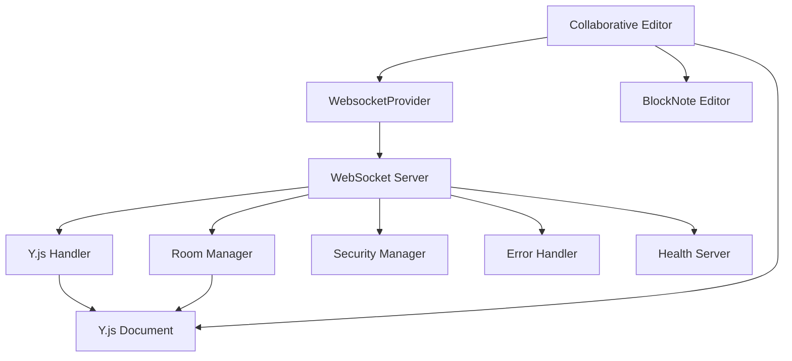
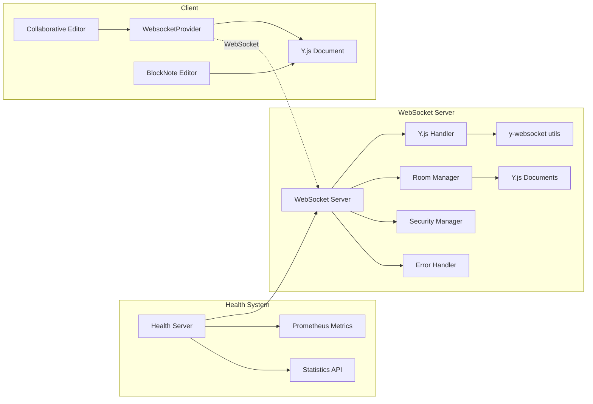

# WebSocket Server Testing & Collaborative Editor Integration Design

## Overview

This design document outlines comprehensive testing strategies and fixes for the WebSocket server package to ensure seamless integration with the collaborative editor component. The WebSocket server provides real-time Y.js document synchronization for collaborative editing using BlockNote editor.

## Architecture

### Component Overview



### Server Architecture



## Current Issues & Fixes

### Issue 1: Y.js Module Import Compatibility

**Problem**: The room-manager.ts uses `require("yjs")` which causes module loading issues in ES modules.

**Fix**: Replace CommonJS require with ES module import:

```typescript
// Current problematic code in room-manager.ts
document: new (require("yjs").Doc)();

// Fixed version
import * as Y from "yjs";
document: new Y.Doc();
```

### Issue 2: Collaborative Editor Connection Flow

**Problem**: The collaborative editor expects specific WebSocket URL format and connection states.

**Analysis**: The collaborative editor uses:

- Base URL: `process.env.NEXT_PUBLIC_WEBSOCKET_URL || "ws://localhost:1234"`
- Room path: `${baseUrl}/${stableRoomId}`
- Connection status tracking: "connecting" | "connected" | "disconnected"

**Compatibility Requirements**:

1. Server must accept room names in URL path
2. Server must handle y-websocket protocol properly
3. Connection status events must be emitted correctly

### Issue 3: Authentication & Authorization

**Problem**: Collaborative editor disables authentication for dev mode, but server has authentication hooks.

**Current State**:

- Editor: Authentication disabled for development
- Server: SecurityManager has placeholder authentication methods

### Issue 4: Room Management Synchronization

**Problem**: Room creation and cleanup timing between server and client.

**Analysis**:

- Editor creates stable room IDs: `${entityType}-${entityId}`
- Server extracts room name from URL path
- Room cleanup happens after idle timeout (1 hour default)

## Testing Strategy

### Unit Tests

#### WebSocket Server Core Tests

- Server lifecycle (start/stop)
- Connection handling
- Error recovery
- Configuration validation
- Statistics collection

#### Y.js Handler Tests

- Connection setup with y-websocket utils
- Message type detection
- Cleanup procedures
- Connection tracking
- Room-specific document handling

#### Room Manager Tests

- Room creation/deletion
- Client tracking
- Document lifecycle
- Cleanup timer operations
- Statistics accuracy

#### Security Manager Tests

- Origin validation
- Rate limiting
- Connection tracking
- Future authentication hooks

#### Error Handler Tests

- Error categorization
- Recovery strategies
- Statistics tracking
- Logging integration

#### Health Server Tests

- Health endpoints (/health, /metrics, /stats, /ready, /live)
- Prometheus metrics format
- CORS handling
- Error responses

### Integration Tests

#### WebSocket Connection Flow

- Valid connection acceptance
- Invalid origin rejection
- Multiple clients per room
- Connection cleanup on disconnect

#### Y.js Document Synchronization

- Document state synchronization
- Conflict resolution
- Message protocol compliance
- Performance under load

#### Room Management Integration

- Multi-room scenarios
- Room cleanup with active connections
- Statistics accuracy across rooms

#### Health Monitoring Integration

- Real-time metrics during operations
- Error rate tracking
- Memory usage monitoring

### End-to-End Tests

#### Collaborative Editor Integration

- Editor initialization with WebSocket
- Document loading and saving
- Real-time collaboration between multiple clients
- Connection recovery scenarios
- Auto-save functionality

#### Production Scenarios

- High connection load
- Network interruption recovery
- Server restart with active connections
- Memory leak prevention

## Test Implementation

### Test Environment Setup

```typescript
// Test configuration
const testConfig: ServerConfig = {
  port: 0, // Random available port
  allowedOrigins: ["http://localhost:3000"],
  maxConnections: 100,
  logLevel: "error", // Reduce test noise
  roomCleanupInterval: 1000, // Fast cleanup for tests
  maxIdleTime: 5000, // Short idle time for tests
};
```

### Mock Strategy

```typescript
// Y.js mocking for unit tests
vi.mock("yjs", () => ({
  Doc: vi.fn().mockImplementation(() => ({
    destroy: vi.fn(),
    getXmlFragment: vi.fn().mockReturnValue({}),
  })),
}));

// y-websocket mocking
vi.mock("y-websocket/bin/utils", () => ({
  setupWSConnection: vi.fn().mockReturnValue(() => {}),
}));
```

### Collaborative Editor Test Cases

#### Basic Connection Test

```typescript
describe("Collaborative Editor Integration", () => {
  it("should connect and sync with WebSocket server", async () => {
    // Setup server
    const server = new CollaborativeWebSocketServer(config);
    await server.start();

    // Setup client similar to collaborative editor
    const doc = new Y.Doc();
    const wsUrl = `ws://localhost:${port}/test-entity-123`;
    const provider = new WebsocketProvider(wsUrl, "test-entity-123", doc);

    // Wait for connection
    await new Promise((resolve) => {
      provider.on("status", (event) => {
        if (event.status === "connected") resolve(void 0);
      });
    });

    expect(provider.wsconnected).toBe(true);
  });
});
```

#### Document Synchronization Test

```typescript
it("should synchronize document changes between clients", async () => {
  // Setup two clients
  const doc1 = new Y.Doc();
  const doc2 = new Y.Doc();

  const provider1 = new WebsocketProvider(wsUrl, roomId, doc1);
  const provider2 = new WebsocketProvider(wsUrl, roomId, doc2);

  // Wait for both to connect
  await Promise.all([
    waitForConnection(provider1),
    waitForConnection(provider2),
  ]);

  // Make change in doc1
  const fragment1 = doc1.getXmlFragment("document-store");
  fragment1.insert(0, [{ type: "paragraph", content: "Hello" }]);

  // Wait for synchronization
  await new Promise((resolve) => setTimeout(resolve, 100));

  // Verify doc2 received the change
  const fragment2 = doc2.getXmlFragment("document-store");
  expect(fragment2.toJSON()).toEqual(fragment1.toJSON());
});
```

### Performance Tests

#### Connection Load Test

```typescript
describe("Performance Tests", () => {
  it("should handle 100 concurrent connections", async () => {
    const connections = [];
    const roomId = "load-test-room";

    for (let i = 0; i < 100; i++) {
      const doc = new Y.Doc();
      const provider = new WebsocketProvider(wsUrl, roomId, doc);
      connections.push(provider);
    }

    // Wait for all connections
    await Promise.all(
      connections.map((provider) => waitForConnection(provider))
    );

    const stats = server.getStats();
    expect(stats.totalConnections).toBe(100);
    expect(stats.activeRooms).toBe(1);
  });
});
```

### Error Recovery Tests

#### Network Interruption Test

```typescript
it("should recover from network interruptions", async () => {
  const doc = new Y.Doc();
  const provider = new WebsocketProvider(wsUrl, roomId, doc);

  await waitForConnection(provider);

  // Simulate network interruption
  provider.disconnect();
  expect(provider.wsconnected).toBe(false);

  // Reconnect
  provider.connect();
  await waitForConnection(provider);

  expect(provider.wsconnected).toBe(true);
});
```

## Test Data Management

### Room Identification Patterns

- Entity-based rooms: `project-abc123`, `issue-def456`
- Legacy document rooms: `document-xyz789`
- Test rooms: `test-room-${Date.now()}`

### Test Document Content

```typescript
const testContent = [
  {
    type: "paragraph",
    content: [{ type: "text", text: "Test document content" }],
  },
  {
    type: "heading",
    props: { level: 2 },
    content: [{ type: "text", text: "Test Section" }],
  },
];
```

## Deployment Testing

### Environment Validation

- Development: `ws://localhost:1234`
- Production: WSS with proper certificates
- Docker: Port mapping and environment variables
- Railway: Configuration and health checks

### Health Check Validation

```bash
# Health endpoint
curl http://localhost:2234/health

# Metrics endpoint
curl http://localhost:2234/metrics

# Readiness check
curl http://localhost:2234/ready
```

## Test Execution Plan

### Phase 1: Unit Tests

1. Fix Y.js import issues in room-manager.ts
2. Ensure all unit tests pass
3. Validate code coverage > 90%

### Phase 2: Integration Tests

1. WebSocket server integration
2. Y.js handler integration
3. Health server integration

### Phase 3: End-to-End Tests

1. Collaborative editor integration
2. Multi-client scenarios
3. Performance validation

### Phase 4: Production Readiness

1. Load testing
2. Security validation
3. Deployment testing

## Monitoring & Observability

### Metrics to Track

- Connection count per room
- Message throughput
- Error rates by type
- Memory usage patterns
- Response times

### Logging Strategy

- Debug: Message-level tracing
- Info: Connection lifecycle
- Warn: Recoverable errors
- Error: Critical failures

### Alert Conditions

- Error rate > 5%
- Memory usage > 1GB
- Connection failures > 10/minute
- Health check failures
