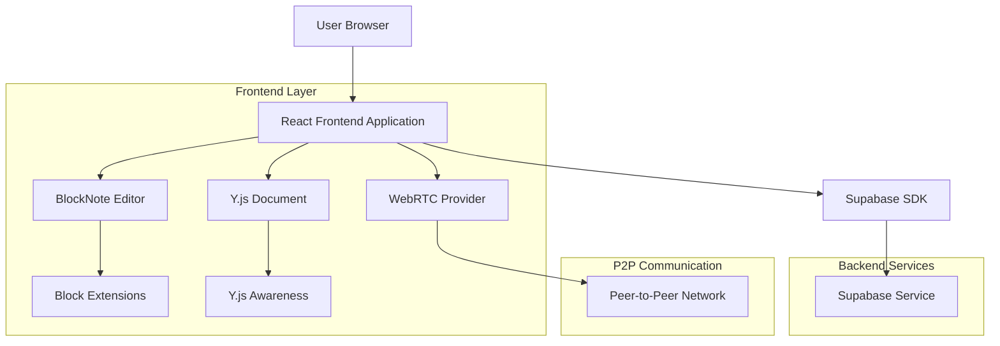
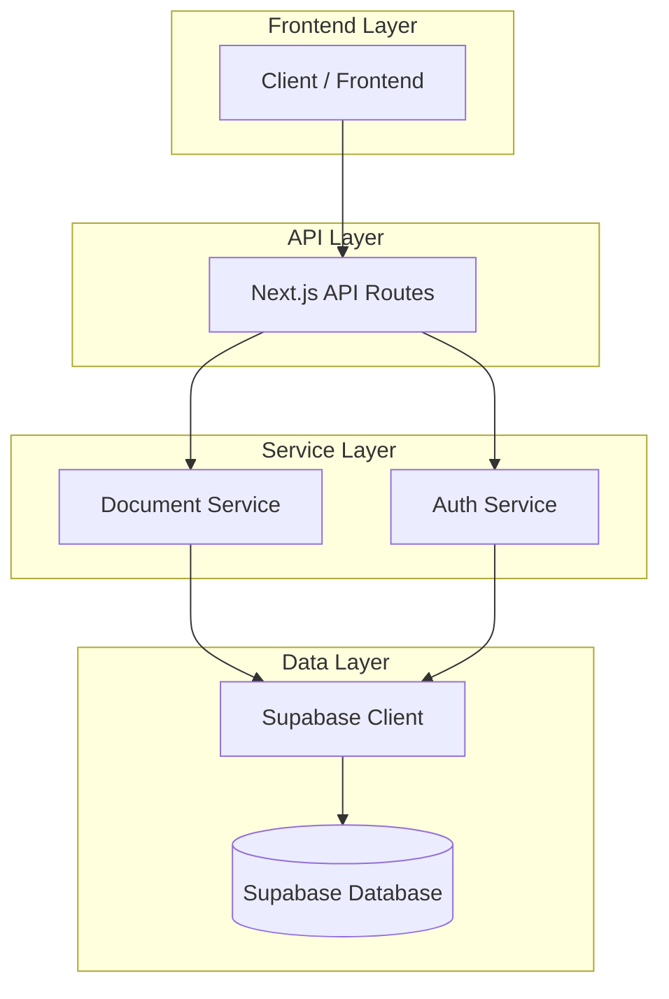
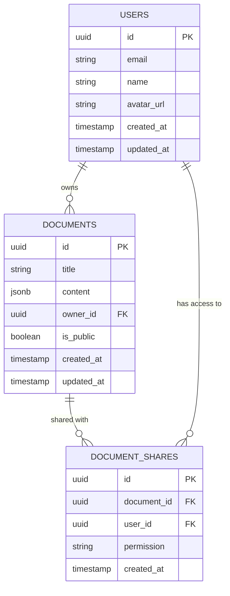

# BlockNote Collaborative Editor - Technical Architecture Document

## 1. Architecture Design



## 2. Technology Description

- Frontend: React@18 + Next.js@14 + TypeScript + Tailwind CSS + Shadcn UI
- Editor: BlockNote@0.15 + ProseMirror (via BlockNote)
- Collaboration: Y.js + y-webrtc + y-prosemirror
- Backend: Supabase (Authentication, Document Storage)
- Real-time: WebRTC for P2P communication
- State Management: Zustand for local state

## 3. Route Definitions

| Route | Purpose |
|-------|----------|
| /editor | Main editor interface for creating new documents |
| /editor/[documentId] | Collaborative editing interface for specific document |
| /editor/[documentId]/share | Simple document sharing controls |

## 4. API Definitions

### 4.1 Core API

Document management related

```
POST /api/documents
```

Request:
| Param Name | Param Type | isRequired | Description |
|------------|------------|------------|-------------|
| title | string | true | Document title |
| content | object | false | Initial BlockNote document state |
| isPublic | boolean | false | Public access setting |

Response:
| Param Name | Param Type | Description |
|------------|------------|-------------|
| id | string | Document unique identifier |
| title | string | Document title |
| createdAt | string | Creation timestamp |
| ownerId | string | Document owner ID |

Example:
```json
{
  "title": "My BlockNote Document",
  "content": {
    "type": "doc",
    "content": [{
      "type": "paragraph",
      "content": []
    }]
  },
  "isPublic": false
}
```

Document sharing related

```
POST /api/documents/[id]/share
```

Request:
| Param Name | Param Type | isRequired | Description |
|------------|------------|------------|-------------|
| permission | string | true | Permission level (view/edit) |

Response:
| Param Name | Param Type | Description |
|------------|------------|-------------|
| success | boolean | Operation status |
| shareUrl | string | Shareable document URL |

## 5. Server Architecture Diagram



## 6. Data Model

### 6.1 Data Model Definition



### 6.2 Data Definition Language

**Documents Table (documents)**
```sql
-- Create documents table
CREATE TABLE documents (
    id UUID PRIMARY KEY DEFAULT gen_random_uuid(),
    title VARCHAR(255) NOT NULL,
    content JSONB DEFAULT '{}',
    owner_id UUID REFERENCES auth.users(id) ON DELETE CASCADE,
    is_public BOOLEAN DEFAULT false,
    created_at TIMESTAMP WITH TIME ZONE DEFAULT NOW(),
    updated_at TIMESTAMP WITH TIME ZONE DEFAULT NOW()
);

-- Create indexes
CREATE INDEX idx_documents_owner_id ON documents(owner_id);
CREATE INDEX idx_documents_created_at ON documents(created_at DESC);
CREATE INDEX idx_documents_updated_at ON documents(updated_at DESC);

-- Enable RLS
ALTER TABLE documents ENABLE ROW LEVEL SECURITY;

-- RLS Policies
CREATE POLICY "Users can view their own documents" ON documents
    FOR SELECT USING (auth.uid() = owner_id);

CREATE POLICY "Users can create documents" ON documents
    FOR INSERT WITH CHECK (auth.uid() = owner_id);

CREATE POLICY "Users can update their own documents" ON documents
    FOR UPDATE USING (auth.uid() = owner_id);

CREATE POLICY "Users can delete their own documents" ON documents
    FOR DELETE USING (auth.uid() = owner_id);

CREATE POLICY "Public documents are viewable" ON documents
    FOR SELECT USING (is_public = true);
```

**Document Shares Table (document_shares)**
```sql
-- Create document_shares table
CREATE TABLE document_shares (
    id UUID PRIMARY KEY DEFAULT gen_random_uuid(),
    document_id UUID REFERENCES documents(id) ON DELETE CASCADE,
    user_id UUID REFERENCES auth.users(id) ON DELETE CASCADE,
    permission VARCHAR(10) CHECK (permission IN ('view', 'edit')),
    created_at TIMESTAMP WITH TIME ZONE DEFAULT NOW(),
    UNIQUE(document_id, user_id)
);

-- Create indexes
CREATE INDEX idx_document_shares_document_id ON document_shares(document_id);
CREATE INDEX idx_document_shares_user_id ON document_shares(user_id);

-- Enable RLS
ALTER TABLE document_shares ENABLE ROW LEVEL SECURITY;

-- RLS Policies
CREATE POLICY "Users can view shares for their documents" ON document_shares
    FOR SELECT USING (
        EXISTS (
            SELECT 1 FROM documents 
            WHERE documents.id = document_shares.document_id 
            AND documents.owner_id = auth.uid()
        )
    );

CREATE POLICY "Users can view their own shares" ON document_shares
    FOR SELECT USING (auth.uid() = user_id);

CREATE POLICY "Document owners can manage shares" ON document_shares
    FOR ALL USING (
        EXISTS (
            SELECT 1 FROM documents 
            WHERE documents.id = document_shares.document_id 
            AND documents.owner_id = auth.uid()
        )
    );
```

## 7. Component Architecture

### 7.1 Component Structure

```
apps/web/components/blocknote-editor/
├── index.ts                          # Main exports
├── collaborative-editor.tsx          # Main BlockNote editor component
├── hooks/
│   ├── use-collaboration.ts          # Y.js and WebRTC integration
│   ├── use-document.ts               # Document management
│   └── use-presence.ts               # User presence and awareness
├── components/
│   ├── block-toolbar.tsx             # Contextual block toolbar
│   ├── user-presence.tsx             # Live cursors and user indicators
│   ├── sharing-modal.tsx             # Simple document sharing
│   └── connection-status.tsx         # Connection indicator
├── extensions/
│   └── collaboration-extension.ts    # Y.js BlockNote integration
├── providers/
│   ├── collaboration-provider.tsx    # WebRTC and Y.js provider
│   └── document-provider.tsx         # Document context
├── types/
│   ├── editor.types.ts               # Editor-related types
│   └── collaboration.types.ts        # Collaboration types
└── utils/
    ├── yjs-utils.ts                  # Y.js helper functions
    └── blocknote-utils.ts            # BlockNote utilities
```

### 7.2 Key Dependencies

```json
{
  "dependencies": {
    "@blocknote/core": "^0.15.0",
    "@blocknote/react": "^0.15.0",
    "@blocknote/mantine": "^0.15.0",
    "yjs": "^13.6.0",
    "y-webrtc": "^10.2.0",
    "y-prosemirror": "^1.2.0",
    "zustand": "^4.4.0",
    "@supabase/supabase-js": "^2.38.0"
  }
}
```

### 7.3 Integration Points

**BlockNote + Y.js Integration:**
- Use Y.js XmlFragment for BlockNote document structure
- Implement custom Y.js binding for BlockNote's block-based model
- Handle block-level operations and transformations
- Maintain cursor positions across block boundaries

**WebRTC Communication:**
- Establish peer-to-peer connections for real-time sync
- Handle connection failures with graceful fallbacks
- Broadcast presence information and cursor positions
- Manage room-based document sessions

**Supabase Integration:**
- Store document metadata and sharing permissions
- Handle user authentication and authorization
- Persist document snapshots for recovery
- Manage document access control

This architecture provides a streamlined, focused collaborative editing experience built on BlockNote's modern block-based foundation while maintaining robust real-time synchronization capabilities.