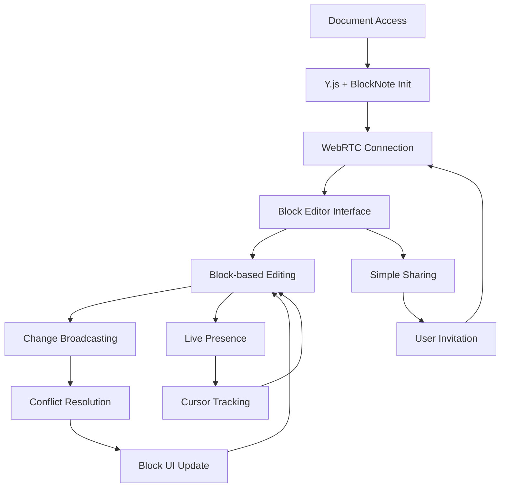

# BlockNote Collaborative Editor - Product Requirements Document

## 1. Product Overview

A streamlined real-time collaborative block-based editor built with BlockNote as the core editing foundation, Y.js for conflict-free multiplayer synchronization, and WebRTC for peer-to-peer communication. The editor focuses exclusively on essential editing functionality and seamless multi-user collaboration, providing a modern block-based writing experience similar to Notion but with reduced complexity.

The product targets teams and individuals who need collaborative document editing with a clean, distraction-free interface that prioritizes core editing and real-time synchronization over advanced features.

## 2. Core Features

### 2.1 User Roles

| Role | Registration Method | Core Permissions |
|------|---------------------|------------------|
| Document Owner | Creates new document | Full edit access, sharing controls |
| Editor | Invited via share link | Can edit content and view all changes |
| Viewer | Invited with view-only access | Can view content only |
| Anonymous User | Direct link access | Limited access based on document settings |

### 2.2 Feature Module

Our BlockNote collaborative editor consists of the following streamlined components:

1. **Block Editor**: BlockNote-powered editing interface with drag-and-drop block management
2. **Real-time Sync**: Y.js integration for conflict-free collaborative editing
3. **User Presence**: Live cursors and user awareness indicators
4. **Document Management**: Basic document creation and sharing functionality

### 2.3 Page Details

| Page Name | Module Name | Feature description |
|-----------|-------------|---------------------|
| Block Editor | Core Editor | Implement BlockNote editor with essential block types (text, headings, lists, images). Support drag-and-drop block reordering and slash commands |
| Block Editor | Block Toolbar | Provide contextual block formatting options and block type conversion |
| Real-time Sync | Y.js Integration | Handle conflict-free collaborative editing using Y.js CRDT with BlockNote's document structure |
| Real-time Sync | WebRTC Communication | Establish peer-to-peer connections for real-time synchronization and presence awareness |
| User Presence | Live Cursors | Display real-time user cursors with names and colors within blocks |
| User Presence | User Indicators | Show active users list with avatars and connection status |
| Document Management | Basic Sharing | Implement simple document sharing via links with view/edit permissions |

## 3. Core Process

**Document Creation and Collaboration Flow:**
1. User creates a new document or opens existing one
2. System initializes Y.js document with BlockNote's block structure
3. WebRTC connections are established for real-time communication
4. User begins editing with block-based interface and real-time synchronization
5. Changes are broadcasted via WebRTC and merged using Y.js conflict resolution
6. Users can share documents with simple permission controls
7. All participants see live cursors and block-level changes in real-time

**Real-time Block Synchronization Flow:**
1. User modifies a block in BlockNote editor
2. Change is captured and converted to Y.js operation
3. Operation is broadcasted to all connected peers via WebRTC
4. Remote peers receive and apply operation to their Y.js document
5. BlockNote editor updates with merged block changes
6. Conflict resolution handled automatically by Y.js CRDT

## 4. User Interface Design

### 4.1 Design Style

- **Primary Colors**: Clean whites and light grays with subtle accent colors for user presence (blue, green, purple, orange)
- **Button Style**: Minimal rounded buttons with subtle hover states and smooth transitions
- **Font**: Inter or system fonts, 16px base size for content, 14px for UI elements
- **Layout Style**: Full-width editor with minimal chrome, focus on content blocks
- **Icons**: Lucide React icons for consistency, 20px standard size for block controls

### 4.2 Page Design Overview

| Page Name | Module Name | UI Elements |
|-----------|-------------|-------------|
| Block Editor | Main Interface | Clean white/dark background, full-width block container, subtle block hover states with drag handles |
| Block Editor | Block Toolbar | Contextual toolbar appearing on block selection, slash command menu for block insertion |
| User Presence | Live Indicators | Colored cursor indicators within blocks, compact user avatar list in top-right corner |
| User Presence | Connection Status | Subtle connection indicator, minimal sync status without intrusive notifications |
| Document Management | Sharing Interface | Simple modal with sharing link and basic permission toggle (view/edit) |

### 4.3 Responsiveness

Mobile-first approach with touch-optimized block interactions. Responsive block widths that adapt to screen size, touch-friendly drag handles for mobile block reordering, and simplified toolbar for smaller screens.

## 5. Removed Features

To maintain focus on core editing and collaboration, the following features from the previous Tiptap implementation are intentionally removed:

- **Comments System**: No inline comments or discussion threads
- **Version History**: No document versioning or rollback functionality
- **Advanced Formatting**: Limited to essential block types and basic text formatting
- **Complex Toolbar**: Simplified to contextual block-level controls only
- **Document Analytics**: No tracking of document activity or detailed metrics
- **Advanced Sharing**: No granular permission management or team features
- **Export Options**: No document export functionality
- **Plugin System**: No extensibility for third-party integrations

This streamlined approach ensures a fast, focused editing experience that prioritizes real-time collaboration and block-based content creation.