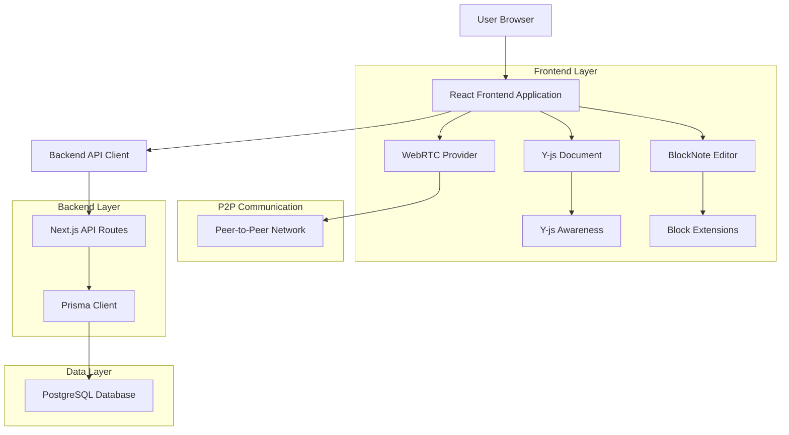
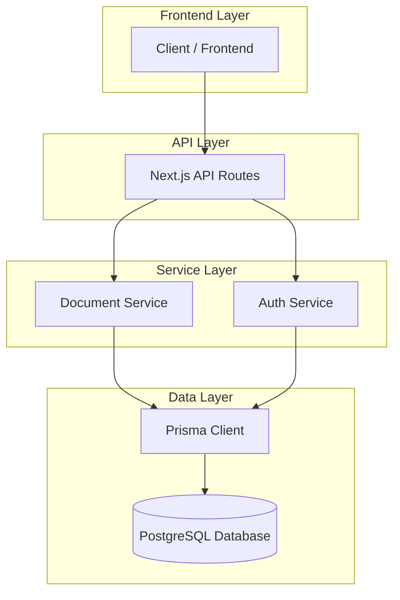
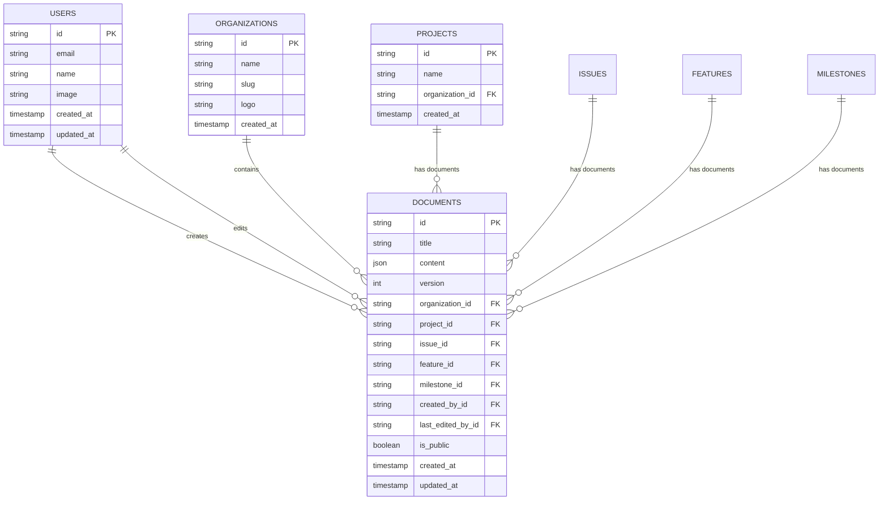

# BlockNote Collaborative Editor - Technical Architecture Document

## 1. Architecture Design



## 2. Technology Description

* Frontend: React\@18 + Next.js\@14 + TypeScript + Tailwind CSS + Shadcn UI

* Editor: BlockNote\@0.15 + ProseMirror

* Collaboration: Y-js + y-webrtc + y-blocknote

* Backend: Prisma + PostgreSQL + Next.js API Routes

* Real-time: WebRTC for P2P communication

* State Management: Zustand for local state + TanStack Query for server state

## 3. Route Definitions

| Route                         | Purpose                                               |
| ----------------------------- | ----------------------------------------------------- |
| /editor                       | Main editor interface for creating new documents      |
| /editor/\[documentId]         | Collaborative editing interface for specific document |
| /api/documents                | Document CRUD operations and metadata management     |
| /api/documents/\[id]/content  | Document content persistence and retrieval           |

## 4. API Definitions

### 4.1 Core API

Document management related

```
POST /api/documents
```

Request:

| Param Name     | Param Type | isRequired | Description                    |
| -------------- | ---------- | ---------- | ------------------------------ |
| title          | string     | true       | Document title                 |
| content        | object     | false      | Initial BlockNote content      |
| organizationId | string     | true       | Organization context           |
| projectId      | string     | false      | Optional project association   |
| isPublic       | boolean    | false      | Public access setting          |

Response:

| Param Name     | Param Type | Description                |
| -------------- | ---------- | -------------------------- |
| id             | string     | Document unique identifier |
| title          | string     | Document title             |
| organizationId | string     | Organization ID            |
| createdAt      | string     | Creation timestamp         |
| createdById    | string     | Document creator ID        |

Example:

```json
{
  "title": "My Collaborative Document",
  "content": {},
  "organizationId": "org-123",
  "projectId": "proj-456",
  "isPublic": false
}
```

Document content persistence

```
PUT /api/documents/[id]/content
```

Request:

| Param Name | Param Type | isRequired | Description                     |
| ---------- | ---------- | ---------- | ------------------------------- |
| content    | object     | true       | BlockNote document content      |
| version    | number     | true       | Document version for optimistic updates |

Response:

| Param Name | Param Type | Description           |
| ---------- | ---------- | --------------------- |
| success    | boolean    | Operation status      |
| version    | number     | Updated version number |

## 5. Server Architecture Diagram



## 6. Data Model

### 6.1 Data Model Definition



### 6.2 Prisma Schema Integration
The collaborative editor integrates with the existing Prisma schema from `@workspace/backend`. The relevant models are:

```prisma
model User {
  id                String    @id @default(cuid())
  email             String    @unique
  name              String?
  image             String?
  createdAt         DateTime  @default(now())
  updatedAt         DateTime  @updatedAt
  
  // Document relationships
  createdDocuments  Document[] @relation("DocumentCreator")
  editedDocuments   Document[] @relation("DocumentEditor")
  
  @@map("users")
}

model Organization {
  id        String     @id @default(cuid())
  name      String
  slug      String     @unique
  logo      String?
  createdAt DateTime   @default(now())
  
  documents Document[]
  projects  Project[]
  
  @@map("organizations")
}

model Document {
  id               String        @id @default(cuid())
  title            String
  content          Json          @default("{}")
  version          Int           @default(1)
  organizationId   String
  projectId        String?
  issueId          String?
  featureId        String?
  milestoneId      String?
  createdById      String
  lastEditedById   String?
  isPublic         Boolean       @default(false)
  createdAt        DateTime      @default(now())
  updatedAt        DateTime      @updatedAt
  
  // Relationships
  organization     Organization  @relation(fields: [organizationId], references: [id], onDelete: Cascade)
  project          Project?      @relation(fields: [projectId], references: [id], onDelete: Cascade)
  issue            Issue?        @relation(fields: [issueId], references: [id], onDelete: Cascade)
  feature          Feature?      @relation(fields: [featureId], references: [id], onDelete: Cascade)
  milestone        Milestone?    @relation(fields: [milestoneId], references: [id], onDelete: Cascade)
  createdBy        User          @relation("DocumentCreator", fields: [createdById], references: [id], onDelete: Cascade)
  lastEditedBy     User?         @relation("DocumentEditor", fields: [lastEditedById], references: [id], onDelete: SetNull)
  
  @@map("documents")
}

model Project {
  id             String       @id @default(cuid())
  name           String
  organizationId String
  createdAt      DateTime     @default(now())
  
  organization   Organization @relation(fields: [organizationId], references: [id], onDelete: Cascade)
  documents      Document[]
  
  @@map("projects")
}
```

**Key Integration Points:**
- Documents are scoped to organizations for multi-tenancy
- Version tracking is built into the Document model
- User relationships track both creators and editors
- Content is stored as JSON for BlockNote compatibility
- Integration with existing project management entities (Issues, Features, Milestones)

