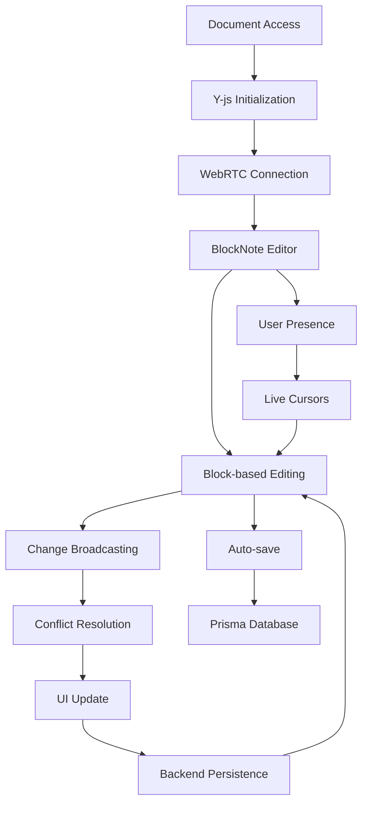

# BlockNote Collaborative Editor - Product Requirements Document

## 1. Product Overview

A streamlined real-time collaborative block-based editor built with BlockNote for modern editing experience, Y-js for conflict-free multiplayer synchronization, and WebRTC for peer-to-peer communication. The editor enables multiple users to simultaneously edit documents with live cursors, real-time changes, and seamless collaboration features while integrating with the existing Prisma backend.

The product targets teams and organizations who need collaborative document editing with block-based content structure, real-time synchronization, and integration with existing project management workflows.

## 2. Core Features

### 2.1 User Roles

| Role | Registration Method | Core Permissions |
|------|---------------------|------------------|
| Document Owner | Creates new document | Full edit access, user management, sharing controls |
| Editor | Invited via share link/email | Can edit content, add comments, view all changes |
| Viewer | Invited with view-only access | Can view content, add comments, cannot edit |
| Anonymous User | Direct link access | Limited view access based on document settings |

### 2.2 Feature Module

Our BlockNote collaborative editor consists of the following streamlined components:

1. **Editor Canvas**: Block-based editing interface with drag-and-drop, slash commands, inline formatting
2. **Collaboration Panel**: Live user cursors, presence indicators, user avatars
3. **Document Management**: Document creation, organization integration, basic sharing
4. **Real-time Sync**: WebRTC-based conflict resolution, Y-js CRDT, backend persistence

### 2.3 Page Details

| Page Name | Module Name | Feature description |
|-----------|-------------|---------------------|
| Editor Canvas | BlockNote Editor | Implement BlockNote editor with block-based editing, drag-and-drop reordering, slash commands for block creation |
| Editor Canvas | Inline Formatting | Provide inline text formatting (bold, italic, underline, code) and block type conversion (headings, lists, quotes) |
| Collaboration Panel | Live Presence | Display real-time user cursors with names and colors. Show active users list with avatars and connection status |
| Collaboration Panel | User Awareness | Show typing indicators, selection highlights, and real-time user activity within blocks |
| Document Management | Organization Integration | Create and manage documents within organization context, link to projects/features/issues |
| Document Management | Backend Persistence | Save document state to Prisma database, handle auto-save and manual save operations |
| Real-time Sync | Y-js Integration | Handle conflict-free collaborative editing using Y-js CRDT, manage document state synchronization |
| Real-time Sync | WebRTC Communication | Establish peer-to-peer connections for real-time data exchange, fallback to backend when needed |

## 3. Core Process

**Document Creation and Collaboration Flow:**
1. User creates a new document within organization context or opens existing one
2. System initializes Y-js document and establishes WebRTC connections
3. User begins block-based editing with real-time synchronization to other connected users
4. Changes are broadcasted via WebRTC and merged using Y-js conflict resolution
5. Document state is automatically persisted to Prisma database
6. All participants see live cursors, block-level changes, and user presence indicators

**Real-time Synchronization Flow:**
1. User makes edit in BlockNote editor (block creation, modification, or deletion)
2. Change is captured and converted to Y-js operation
3. Operation is broadcasted to all connected peers via WebRTC
4. Remote peers receive and apply operation to their Y-js document
5. BlockNote editor is updated with merged changes at block level
6. Conflict resolution handled automatically by Y-js CRDT, changes saved to backend

## 4. User Interface Design

### 4.1 Design Style

- **Primary Colors**: Clean whites and grays with accent colors for user presence (blue, green, purple, orange)
- **Button Style**: Rounded corners with subtle shadows, hover states with smooth transitions
- **Font**: Inter or system fonts, 14px base size for content, 12px for UI elements
- **Layout Style**: Minimal sidebar with document tree, main editor canvas, floating toolbars
- **Icons**: Lucide React icons for consistency, 16px standard size

### 4.2 Page Design Overview

| Page Name | Module Name | UI Elements |
|-----------|-------------|-------------|
| Editor Canvas | BlockNote Editor | Clean white/dark background, block-based layout with hover states, drag handles for reordering, slash command menu |
| Editor Canvas | Block Controls | Inline formatting toolbar on text selection, block type selector, drag-and-drop indicators, block-level actions |
| Collaboration Panel | User Presence | Colored cursor indicators with user names, avatar stack in top-right corner, smooth animations for cursor movements |
| Collaboration Panel | User Awareness | Real-time typing indicators, block-level selection highlights, connection status badges |
| Document Management | Organization Context | Document title with organization/project context, breadcrumb navigation, save status indicator |
| Real-time Sync | Connection Status | Subtle connection indicator, sync status with loading states, WebRTC connection health |

### 4.3 Responsiveness

Desktop-first approach with mobile adaptations. Touch-optimized toolbar for mobile devices, responsive sidebar that collapses on smaller screens, and gesture support for mobile editing interactions.
